# Escalatiepaden — lagen & stages (flowcharts)

Peildatum: 2026-07-31 · Companion bij [`escalatiepaden-inventaris.md`](escalatiepaden-inventaris.md)

Per laag/stage: **één mermaid flowchart** (hoofdweg + escalatietakken). Cat A–E in de node. `*` = over-fit-anker. Geen drempelwijzigingen.

REF / orkestratie / FML-conversie → inventaris §7–9. L13 bestaat niet.

---

## Legenda

| Cat | Naam |
|---|---|
| A | Relax-retry |
| B | Guard/rollback |
| C | Alternatieve meetruimte (`ink`/`white`) |
| D | Compensatie-orkestratie |
| E | Meting weggegooid |
| P | Primair (geen escalatie) |

---

## Overzicht

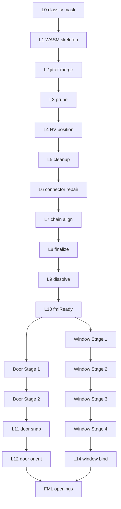

---

## L0 — classify / mask

Face-classes + muurmasker vóór V3. Input B/W+classify → wall-blobs voor L1.

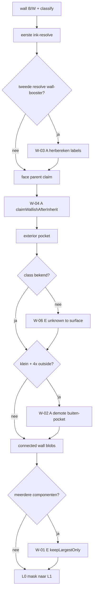

---

## L1 — WASM skeleton

Geen escalatiepaden in inventaris — alleen primaire skeleton-trace.

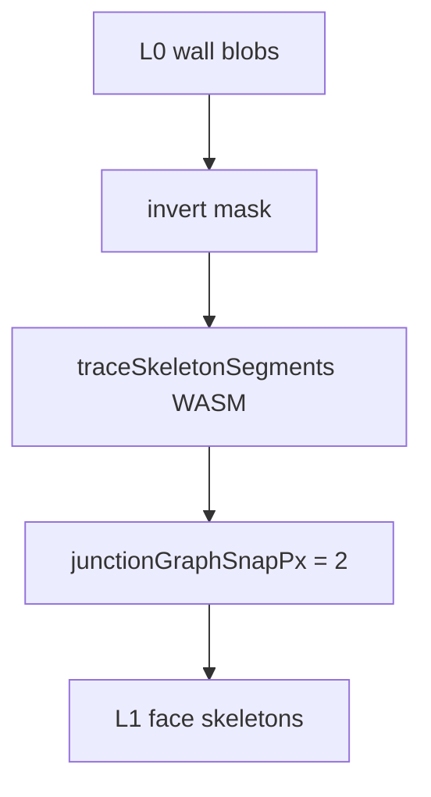

---

## L2 — jitter merge

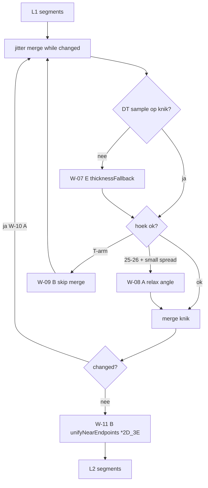

---

## L3 — prune

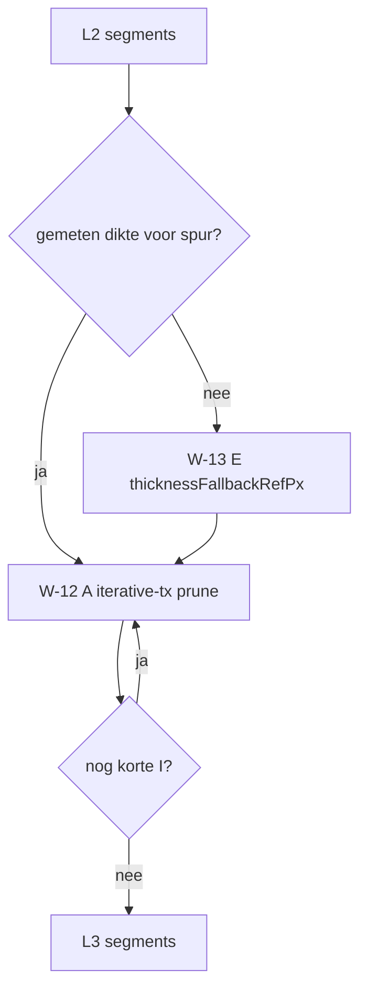

---

## L4 — HV position

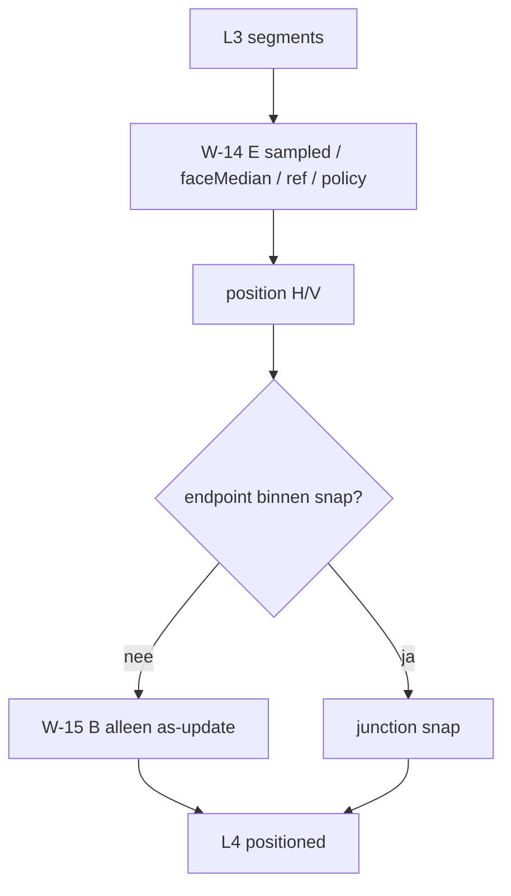

---

## L5 — cleanup

Per face: cleanup-stappen achter connectivity-guard; eindfail → L4.

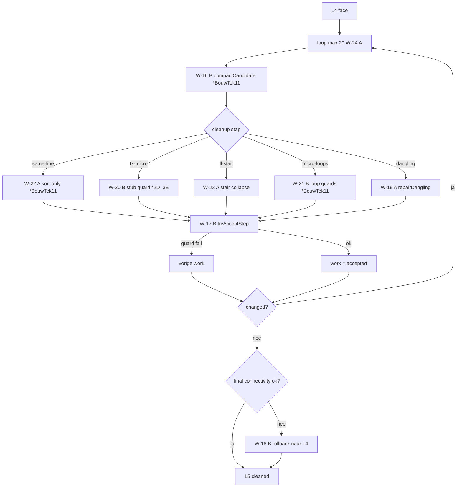

---

## L6 — connector / junction repair

Face-accept houdt laatste face-OK state (niet volledige L5-rollback).

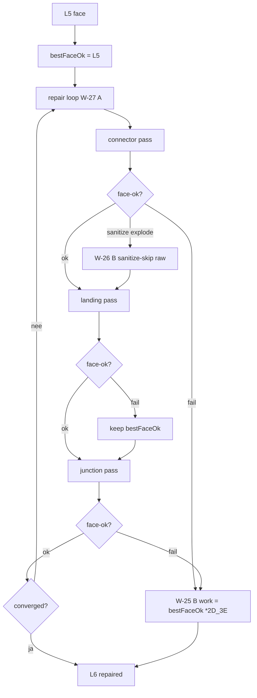

### L6 detail — detect / chamfer / junction

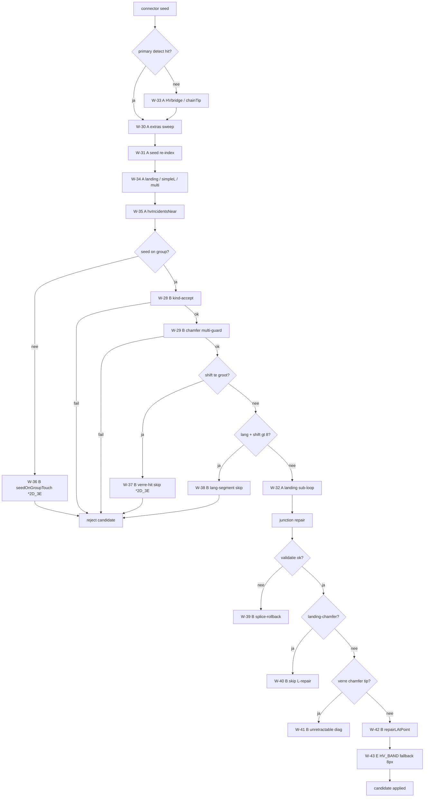

---

## L7 — chain align

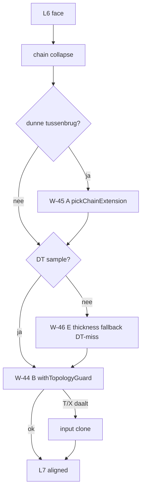

---

## L8 — finalize HV

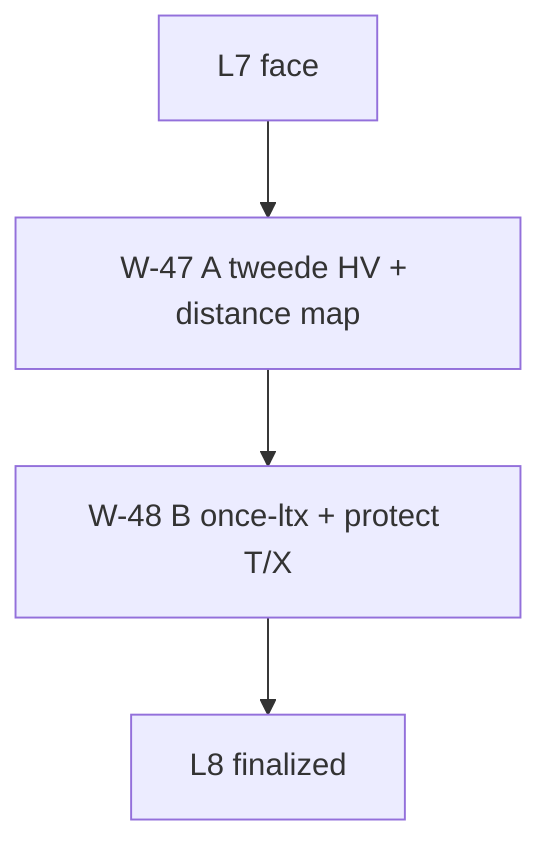

---

## L9 — dissolve

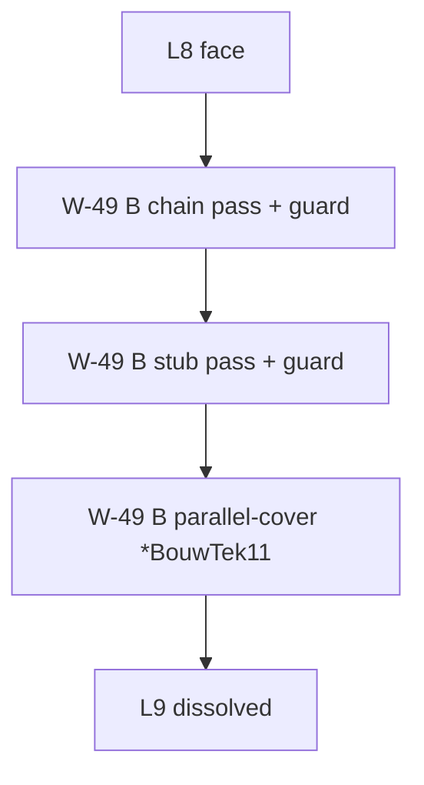

---

## L10 — fmlReady

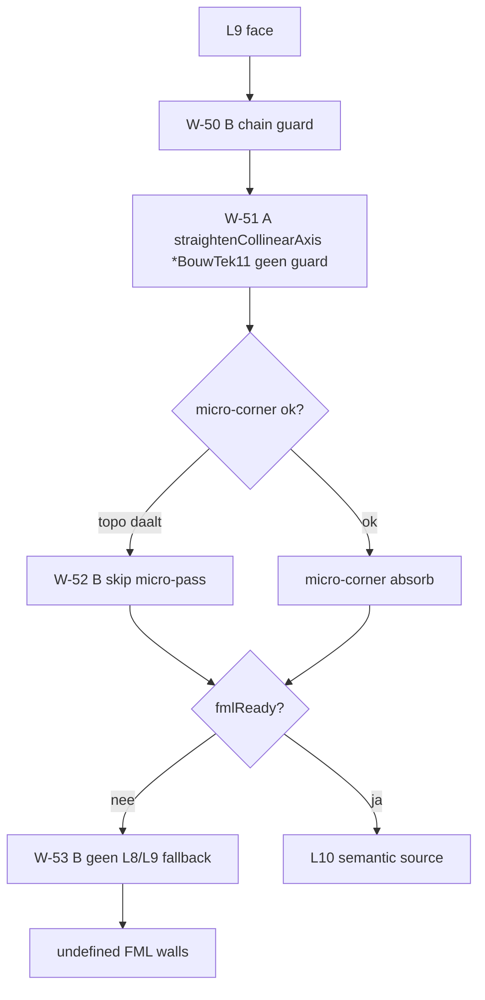

---

## Deuren — space policy

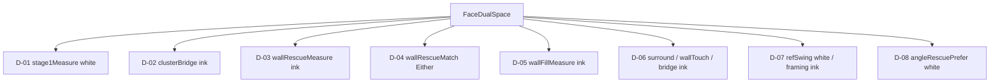

---

## Door Stage 1 — seed / match / cluster

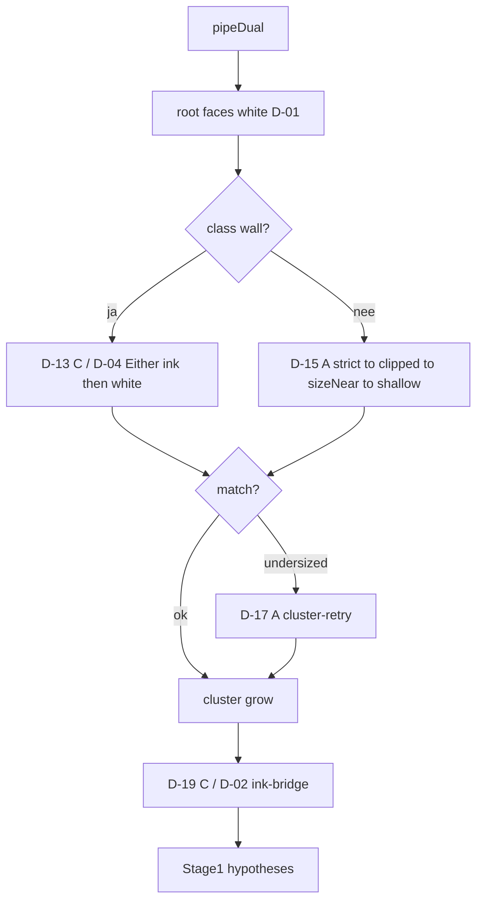

### Door Stage 1 detail — match cascade

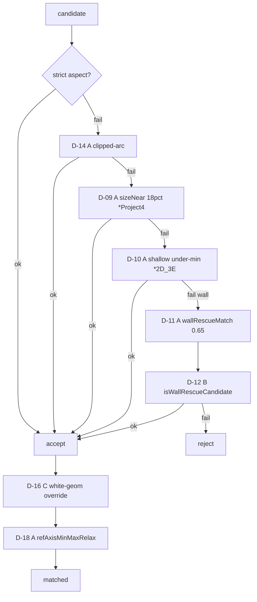

### Door Stage 1 detail — cluster

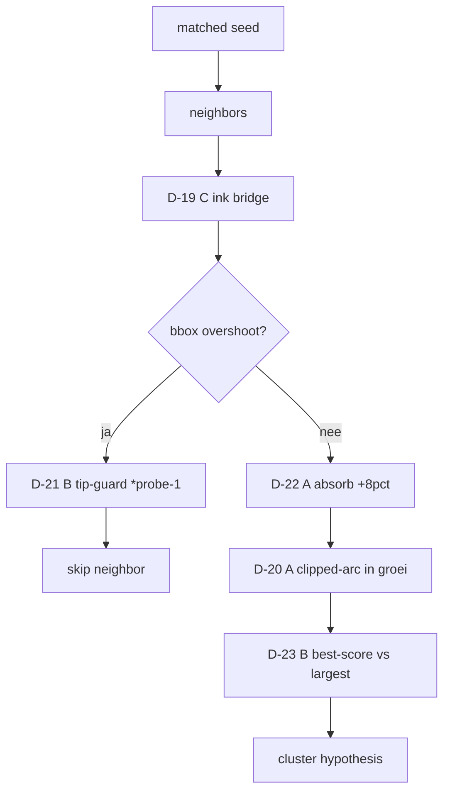

---

## Door Stage 2 — fill / surround / angle-rescue / bridge

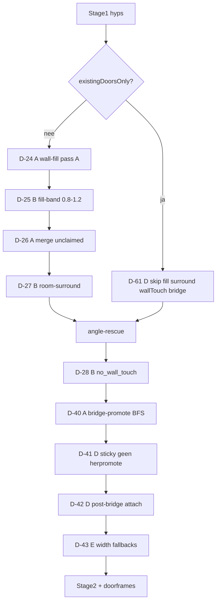

### Door Stage 2 detail — angle-rescue

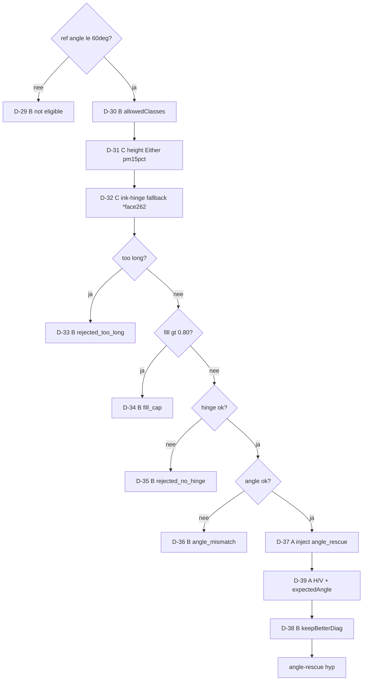

---

## L11 — door snap

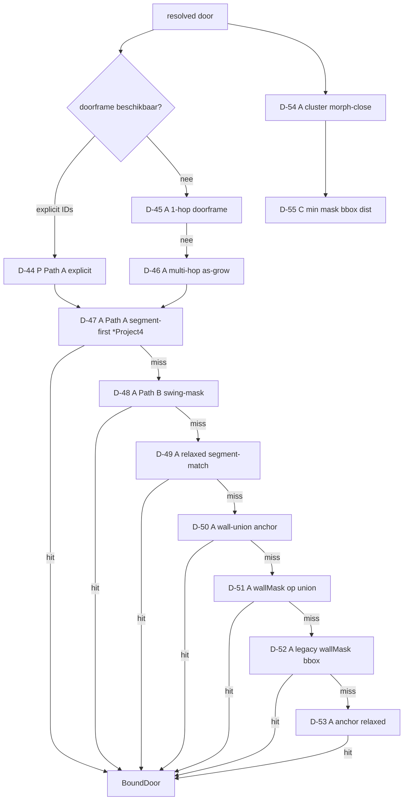

---

## L12 — door orient

```mermaid
flowchart TD
  bound[BoundDoor] --> purge["D-56 B kept-mask purge"]
  purge -->|no contact| drop[reject + unpin]
  purge -->|ok| swing180["D-57 A 180deg swing orient"]
  swing180 --> pathAB["D-58 A Path A vs B width"]
  pathAB --> hinge{hinge ok?}
  hinge -->|nee| D59B["D-59 B hard gate drop FML"]
  hinge -->|ja| blade{blade degenerate?}
  blade -->|ja| D60E["D-60 E swing-span maat"]
  blade -->|nee| oriented[OrientedDoor]
  D60E --> oriented
```

---

## Window Stage 1 — axel / strip

```mermaid
flowchart TD
  dual[pipeDual] --> rebind["R-01 C dual-rebind na detach"]
  rebind --> ref[analyzeWindowAxelRef]
  ref --> asym{asymmetrische rails?}
  asym -->|ja| R02A["R-02 A strip_stack *Project4"]
  asym -->|nee| rails
  R02A --> rails["R-03 A as-band uit rails"]
  rails --> metric["R-04 C ink-vs-white rail"]
  metric --> heights["R-05 E fullStripHeights fallback"]
  heights --> filter[runWindowAxelFilter]
  filter --> orient{orient miss?}
  orient -->|ja| R06A["R-06 A H/V retry"]
  orient -->|nee| cluster
  R06A --> R07E["R-07 E fallbackToPrimaryTarget"]
  R07E --> cluster[axel cluster]
  cluster --> calib["R-08 A bounded strip-calib *DeRoemer"]
  calib --> sample["R-09 A band to centroid"]
  sample --> tall["R-10 A height tol 70pct *2D_3E"]
  tall --> floors["R-11 E px floors 2/3/4"]
  floors --> spanG{as-span spreiding ok?}
  spanG -->|nee| R12B["R-12 B reject"]
  spanG -->|ja| inkBr["R-13 C wall-ink bridge relaxed"]
  inkBr --> outS1[Stage1 hypotheses]
```

---

## Window Stage 2 — deurboog

```mermaid
flowchart TD
  s1[Stage1 hyps] --> touch{touches door arc?}
  touch -->|white miss| R14C["R-14 C ink-adjacency 1-hop"]
  touch -->|ja| rejectArc[reject as window]
  R14C --> prop["R-15 A directional arc propagate"]
  prop --> dfCand[doorframeCandidates]
  rejectArc --> dfCand
  touch -->|nee| kept[Stage2 kept windows]
```

---

## Window Stage 3 — evidence

```mermaid
flowchart TD
  kept[Stage2 kept] --> evidence{evidence mode?}
  evidence -->|strip_stack| stack["R-17 C stack BFS ink *DeRoemer"]
  evidence -->|framing| frame["R-18 C framing OR white/ink"]
  evidence -->|passthrough| pass["R-16 A accept zonder bewijs"]
  stack --> early{span/heights?}
  early -->|nee| R20B["R-20 B early exit seed only"]
  early -->|ja| accepted
  frame --> soft["R-19 A framing soft-min 25pct"]
  soft --> accepted
  R20B --> accepted
  pass --> accepted[Stage3 accepted]
  accepted --> retarget["R-21 D late retarget naar doorframes"]
  retarget --> outS3[Stage3 + doorframes]
```

---

## Window Stage 4 — resolve

```mermaid
flowchart TD
  s3[Stage3 accepted] --> bbox["R-22 C glass whiteThenInk / frame inkThenWhite"]
  bbox --> measure{dual geom?}
  measure -->|nee| R23E["R-23 E unionBBox fallback"]
  measure -->|ja| merge
  R23E --> merge["R-24 A cross-ref stack-merge"]
  merge --> dedupe["R-25 B framing de-dupe score"]
  dedupe --> resolved[ResolvedWindowCandidate]
```

---

## L14 — window bind / merge

```mermaid
flowchart TD
  resolved[Stage4 windows] --> bind[window-wall-bind]
  bind --> width{widthPx gt 0?}
  width -->|nee| R26E["R-26 E projected bbox-span"]
  width -->|ja| merge
  R26E --> merge["R-27 A adjacent merge double/triple *2D_3E"]
  merge --> fmlWin[FML windows]
```

---

## L13

Bestaat niet. Nummering springt van L12 (deur) naar L14 (raam).

---

## Verwijzingen

- [`escalatiepaden-inventaris.md`](escalatiepaden-inventaris.md) — tabellen + triggers
- [`escalatiepaden-tagindex.md`](escalatiepaden-tagindex.md) — code-locaties
- [`escalatiepaden-aanpak.md`](escalatiepaden-aanpak.md) — opruim-aanpak
- [`door-detection-flow.md`](door-detection-flow.md) / [`window-detection-flow.md`](window-detection-flow.md)
