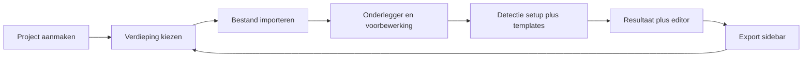

# V1 – Gebruikersworkflow & schermopbouw

Vastgesteld: juni 2026. Bron: productwens + mockups in `.cursor/docs/Wensen/`.

Doel van dit document: **één leidende UX-flow** voor implementatie, afgestemd op technische pipeline (`project-brief.md`, `decisions.md`, `klant-eisen-v1.md`).

---

## Overzicht (fases)



Per **verdieping** doorloop je C→G. Projectgegevens (A) gelden voor het hele project.

---

## Fase 0 – Project aanmaken (first screen)

**Referentie:** `.cursor/docs/Wensen/1st.png` (mockup; schaal in UI mag compacter dan in schets).

### Velden

| Veld | Verplicht | Opmerking |
|------|:---------:|-----------|
| Adres / projectnaam | ✓ | Herkenbaar in projectlijst |
| Taal | ✓ | UI-taal; later relevant voor roomtags |
| Verdiepingen | min. 1 | Lijst met benoemde verdiepingen |

### Verdiepingen-UI

- Dynamische **lijst**: per regel een tekstveld voor verdiepingsnaam (bijv. *Begane grond*, *Eerste verdieping*).
- Onder de lijst een **+**-knop om een verdieping toe te voegen.
- Verdiepingen mogen **later** worden toegevoegd of hernoemd.
- **Validatie:** geen lege invoer — adres, taal en elke verdiepingsnaam zijn verplicht vóór “Project aanmaken”. Knop blijft disabled of toont foutmelding bij lege velden.

### Na “Project aanmaken”

- Navigatie naar **werkruimte** met verdieping-tabs in de bovenbalk (vergelijkbaar mockup *before export*).
- Eerste verdieping actief; overige tabs tonen lege staat tot import.

---

## Fase 1 – Bestand importeren (per verdieping)

### Invoermethoden

| Methode | V1 |
|---------|:--:|
| Bestand kiezen | ✓ |
| Drag & drop | ✓ |
| Plakken van klembord | ✓ — **alleen afbeeldingen** (PNG/JPG); geen PDF via klembord |
| PDF | ✓ — **apart venster** om juiste pagina te kiezen (alleen via bestand/drop) |

> **Besluit afwijking:** `decisions.md` noemde PDF als V2; productwens en offerte nemen PDF wél op in V1. **PDF-paginaselectie** is de V1-scope (geen volledige PDF-engine beyond render + kiezen).

### Ondersteunde formaten

PNG, JPG, JPEG, PDF (één pagina per verdieping na selectie).

### Direct na import

- Afbeelding verschijnt op canvas.
- Canvas toont de tekening **afgegrijsd / gedimd** zolang schaal nog niet is bevestigd.
- **Schaal-H's** worden **direct** op de onderlegger geprojecteerd (zie §2.3).
- **Zijbalk** (links) wordt beschikbaar met voorbereidingstools.

---

## Fase 2 – Voorbereiding (sidebar, eerste uitklap)

Sidebar opent met **icoonknoppen** en bijbehorende panels. Volgorde in UI (logisch voor tekenaar):

### 2.1 Crop *(optioneel)*

- **Niet verplicht** — default: volledige geïmporteerde afbeelding.
- Indien gebruikt: **rechthoekige selectie** op canvas (square selector).
- Alles **buiten** de selectie: **verborgen** in weergave én **uitgesloten** van CV-pipeline.
- Alleen het crop-gebied is werkbasis voor voorbewerking, schaal en detectie.

### 2.2 Voorbewerking (B&W)

Sliders (zoals in `decisions.md`):

- Helderheid, contrast, threshold, noise reduction, rotatie

**Weergave-eis (twee lagen):**

| Laag | Kleur |
|------|-------|
| **Onderlegger** (raster) | **Zwart-wit** — na voorbewerking; geen kleur in tekening |
| **Vectoroverlay** (muren, deuren, ramen) | **Kleur** — zoals mockups (bijv. geel muren, cyan deuren, paars ramen) voor herkenbaarheid |

Output onderlegger: opgeschoonde B&W-afbeelding, **apart downloadbaar** na export (zonder vectorlagen).

### 2.3 Schalen (twee H-referenties)

Twee **onafhankelijke referenties** voor anisotropische schaal (`pixelsPerMillimeterX` en `pixelsPerMillimeterY`). Zodra de onderlegger op het canvas staat, verschijnen **beide H-overlays direct** — ook terwijl de tekening nog greyed is.

#### Horizontale maat (X-schaal)

Vorm: **H** — twee verticale poten met horizontaal middelstuk op de tekening:

```
|                    |                    ← poten: volledige schermhoogte
|                    |
|========[ mm ]======|                    ← middelstuk: meetsegment op tekening
|                    |
|                    |
```

- **Poten** (verticale lijnen): lopen van boven- naar onderkant van het **viewport** (niet alleen beeld).
- **Middelstuk** (horizontale lijn): ligt op de gekozen maat op de tekening.
- **Sleep:** beide poten zijn **grepen** — verschuif links/rechts om het meetsegment uit te lijnen met een horizontale maat op de bouwtekening.
- **Maatveld:** op het middelstuk — werkelijke afstand in **mm** (of m met eenheid-keuze in UI).

#### Verticale maat (Y-schaal)

Zelfde principe, **90° gedraaid** — twee horizontale poten over volledige schermbreedte, verticaal middelstuk:

```
========================================  ← poten: volledige schermbreedte

              [ mm ]
                |
                |

========================================
```

- **Poten** verschuiven omhoog/omlaag; maatveld op het verticale middelstuk.

#### Bevestiging (rechterkant scherm)

Vast actieblok **rechts** op het canvas (niet in de sidebar):

| Control | Actie |
|---------|-------|
| ✓ (checkmark) | Schaal **toepassen** — beide maten verwerken → `pixelsPerMillimeterX/Y`; onderlegger **niet meer greyed** |
| ✕ (kruis) | **Annuleren** — wijzigingen sinds openen schaalmodus ongedaan; vorige bevestigde schaal blijft (indien aanwezig) |

Beide maten moeten ingevuld zijn vóór bevestiging; ✓ blijft disabled of toont hint tot beide mm-velden geldig zijn.

#### Herschalen (Settings)

- Opent **dezelfde H-overlay** met **opgeslagen posities én mm-waarden** — geen reset naar defaults.
- Doel: **mini-aanpassingen** zonder opnieuw uitlijnen.
- Na ✓ opnieuw bevestigen: schaal bijgewerkt; bestaande vectoren moeten opnieuw berekend worden (waarschuwing tonen indien detectie al liep).

#### Technische notities

- Overlay in **scherm-/viewport-coördinaten** voor de poten (altijd zichtbaar bij pan/zoom); middelstuk en grepen transformeren mee met canvas (image space).
- Referentiepatroon: vergelijkbaar met Crosscheck `CalibrationOverlay`, maar BouwToFML gebruikt **twee losse H'en** (horizontaal + verticaal), niet één kruis-rechthoek.
- Lijnkleur per H uit **Menu → Kleuren** (`scaleHorizontal` / `scaleVertical`); defaults instelbaar, opgeslagen in localStorage.
- **Gate:** detectie en template-matching geblokkeerd tot schaal minstens één keer bevestigd is (✓).

---

## Fase 3 – Detectie (sidebar, tweede uitklap)

Dezelfde **linkse rail schuift verder open** voor detectie-setup + train-by-example (geen aparte sidebar-breedte).

### Detectie-setup vóór genereren

- Kies hier het profiel: **Simpel / Standaard / Detail**.
- OCR staat in deze fase als toggle (+ geavanceerde instellingen) en wordt niet meer vóór upload gekozen.
- Stap 2 (voorbewerking) blijft leidend voor B&W tuning; profiel stuurt alleen detectiegedrag.

### Selectievakken op tekening

| Type | Doel |
|------|------|
| Deuren | 3–5 voorbeelden — start **standaard draai**; optioneel schuif/garage/opening bij missers |
| Ramen | 3–5 voorbeelden — **kozijnstijl**; optioneel rond/halfrond |
| Muren | Lijnpatroon / arcering — **niet** semantisch buurtype |

Optioneel later inzelfde scherm: trap-voorbeeld (export optioneel V1).

**Geen** train-by-example voor buiten vs. woningsscheidend — muurtype kiest tekenaar **na detectie** in editor.

### Actie

- “Detectie starten” (of automatisch na voldoende voorbeelden) → pipeline volgorde:
  1. Deuren + ramen (template matching, masking)
  2. Clustering-voorstel structureel type (optioneel; batch-review in editor)
  3. Muren + knooppunten
  4. Openingen op muur segmenteren

---

## Fase 4 – Editor (canvas + minimale tools)

**Referentie mockup:** `.cursor/docs/Wensen/voorbeeldschermen/before export.png` — layout: bovenbalk verdiepingen + menu, links toolbar, midden canvas.

### Bovenbalk

- **Links:** tabs per verdieping (naam uit project-setup).
- **Rechts:** **Menu**-knop (rechterbovenhoek) + **oog-icoon** (onderlegger tonen/verbergen).

Projectdefaults (muurdiktes, deurmaten, plafondhoogte) horen **niet** in het Menu — aparte UI (sidebar / verdiepingsinstellingen), zie `klant-eisen-v1.md`.

### Menu (rechterboven)

Dropdown of panel vanaf de **Menu**-knop. V1-inhoud:

#### Nieuw project

- Menu-item: **Nieuw project**.
- Bij klik: **bevestigingsdialoog** — waarschuwing dat de volledige huidige sessie wordt gewist.
- Bij bevestigen:
  - Alle **project-/sessiestatus** verwijderen (verdiepingen, imports, crop, voorbewerking, schaal, templates, detectie, vectors).
  - Navigatie naar **project-setup** (first screen).
- Bij annuleren: geen wijziging.
- **Niet** wissen: gebruikersvoorkeuren uit **Kleuren** (localStorage, zie hieronder).

#### Kleuren

Persoonlijke overlay-kleuren — **geen backend**; opslag in **`localStorage`** per browser/apparaat. Tekenaars stellen zelf in wat voor hen leesbaar is.

| Instelling | Toepassing |
|------------|------------|
| **Muurlijnen** | Vectoroverlay gedetecteerde/bewerkte muren |
| **Deuren** | Vectoroverlay deuren |
| **Ramen** | Vectoroverlay ramen |
| **Linialen — horizontaal** | H-schaalreferentie X (poten + middelstuk) |
| **Linialen — verticaal** | H-schaalreferentie Y (poten + middelstuk) |

UI: kleurkiezer per rij (hex of native color input); optioneel **Standaard herstellen** voor fabriekswaarden (mockup-richtlijn: geel muren, cyan deuren, paars ramen — exacte defaults bij implementatie).

- Wijzigingen **direct** zichtbaar op canvas.
- Overleeft pagina-refresh en **Nieuw project**.
- Geen sync tussen apparaten (bewuste V1-keuze).

**Technisch (richtlijn):** één JSON-object in localStorage, bijv. sleutel `bouwtofml:user-colors`, velden `walls`, `doors`, `windows`, `scaleHorizontal`, `scaleVertical`.

---

### Sneltoetsen (V1, minimaal)

| Toets | Actie |
|-------|-------|
| Spatie **vasthouden** | Onderlegger **tijdelijk** verbergen (loslaten = weer tonen) |
| *(meer later)* | Pan, zoom, undo — aparte lijst bij implementatie |

### Minimale editor (V1)

Zie `klant-eisen-v1.md` §2 — o.a. muurpunt verplaatsen, muur splitsen/toevoegen, muurtype, deur draaien, deur/raam toevoegen + refresh.

**Contextmenu bij geselecteerde opening:**

| Groep | Opties |
|-------|--------|
| Structureel type (deur) | Enkel draaideur · dubbel openslaand · schuifdeur · schuifpui · garagedeur · opening |
| Structureel type (raam) | Enkel · dubbel · driedelig · rond/halfrond |
| Semantische tag (deur) | Voordeur · achterdeur · binnendeur · bovenlicht (○) |

Na detectie: **clustering-review** — lijst met automatische voorstellen (bijv. “4 dubbele deuren”, “2 schuifpuien”) met **Alles bevestigen** of per regel corrigeren.

### Multi-verdieping

- Schakel via tab; schaal **niet** overnemen tussen verdiepingen.
- Bij nieuwe verdieping: keuze **herkenningsinstellingen overnemen** of opnieuw train-by-example.

---

## Fase 5 – Export (sidebar)

Export-knop opent **export-panel** (sidebar rechts of uitklap van linkse toolbar — implementatiedetail).

| Actie | V1 | Opmerking |
|-------|:--:|-----------|
| Onderlegger downloaden | ✓ | Bewerkte B&W na voorbereiding |
| FML downloaden | ✓ | JSON v3, centimeters |
| Versturen via Floorplanner API | V2 | UI-placeholder mag; backend + key later |

Onderlegger **niet** ingebed in FML (V1). Zie `export-options.md`.

---

## Schermstaten (samenvatting)

| Staat | Canvas | Sidebar | Geblokkeerd |
|-------|--------|---------|-------------|
| Geen bestand | Leeg / placeholder | Inactief | Alles behalve import |
| Geïmporteerd, geen schaal | Tekening **greyed** | Onderlegger-tools (crop, voorbewerking, schaal) | Detectie, export FML |
| Geschaald, geen profiel/detectie | Tekening actief B&W | + detectie-setup en template-panel | Detectie |
| Na detectie | B&W onderlegger + **gekleurde** vectoroverlay | Editor + export | — |
| Export open | Zelfde | Export-panel | — |

---

## UI-layout (richtlijnen)

- **Donkere chrome** (mockups), compacte schaal — niet full-bleed mockup-formaat.
- **Linkse rail**: icoon-stapel (voorbereiding, templates, export) — **één rail** die horizontaal **verder openschuift** per fase (niet twee vaste breedtes).
- **Canvas**: KonvaJS; pan/zoom; crop als interactieve rechthoek.
- **Geen embedded Floorplanner-editor** (facturering).

---

## Afstemming met bestaande docs

| Onderwerp | Was | V1 workflow |
|-----------|-----|-------------|
| PDF upload | V2 in `decisions.md` | **V1** met paginaselectie-dialog |
| Kleuren | mockups | **B&W onderlegger** + **gekleurde vectoroverlay** |
| Schaal vs. voorbewerking | beide vóór detectie | Crop + voorbewerking **kunnen vóór schaal**; schaal **gate** voor detectie + un-grey |
| API export | V2 | Knop voorbereid; implementatie V2 |
| Project-setup | niet gedetailleerd in brief | Adres, taal, benoemde verdiepingenlijst |

**Actie:** bij implementatiestart `decisions.md` § Input bijwerken (PDF V1).

---

## Vastgelegde UX-besluiten (jun 2026)

| # | Onderwerp | Besluit |
|---|-----------|---------|
| 1 | Crop | **Optioneel** — default volledige afbeelding |
| 2 | Kleur | **Onderlegger B&W**; **vectoroverlay in kleur** (zoals mockups) |
| 3 | Lege velden | **Niet toegestaan** — adres, taal en elke verdiepingsnaam verplicht |
| 4 | Sidebar | **Één rail** die per fase verder openschuift |
| 5 | Klembord | **Alleen afbeeldingen** (geen PDF plakken) |
| 6 | Schaal-UI | **Twee H-overlays** bij import; poten over volledig scherm; ✓/✕ rechts; herschalen herstelt positie+mm |
| 7 | Menu | Rechtsboven: **Nieuw project** (bevestiging → sessie leeg) + **Kleuren** (localStorage, 5 velden) |

---

## Referenties

- Mockups: `.cursor/docs/Wensen/voorbeeldschermen/before export.png`, `1st.png`
- HTML-prototype (deels verouderd): `.cursor/docs/Wensen/page2-setup.html` — mist adres, taal, benoemde verdiepingslijst
- Pipeline: `project-brief.md` § Gebruikersflow
- Klant: `klant-eisen-v1.md`
