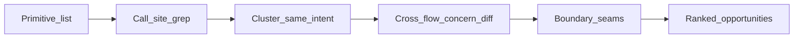

# CV primitive centralisatie-audit

Laatste update: 2026-07-24  
Status: **audit + extracts** — opportunity #1–#5 + #7–#10 gedaan; overige ranked items open.

Gerelateerd: [`door-detection-flow.md`](./door-detection-flow.md), [`window-detection-flow.md`](./window-detection-flow.md), [`archive/wall-face-class-flow.md`](./archive/wall-face-class-flow.md).

---

## Methode

1. Inventariseer gedeelde objecten (`RoomRasterCache`, parentMap, dual, adjacency, class-pin, policy).
2. Call-sites via grep; markeer **lokale herbouw** vs gedeelde API.
3. Deur ↔ raam concern-diff alleen waar concerns overlappen.
4. Seams: muren→openings push, pipeline→UI/export/probe, REF↔floor.
5. Rank alleen bij zelfde intent + ≥2 sites of parallelle herbouw + stabiel contract denkbaar.

**Niet gedaan:** full L1–L10 stage-walk; detectie-tuning; codewijzigingen.

---

## Done / niet opnieuw centraliseren

| Primitive | Owner | Status |
|---|---|---|
| `claimFacesFromParentMap` / `claimFacesInRoomRasterCache` | [`face-parent-claim.ts`](../frontend/src/cv/walls/rooms/face-parent-claim.ts), [`room-raster-cache.ts`](../frontend/src/cv/walls/rooms/room-raster-cache.ts) | Done — wallish-erfenis, refine, deur/raam/doorframe push, pin |
| `FaceDualSpace` + `ensureFaceDualSpace` / `rebindFaceDualWhite` + `pickGeomByPrefer` + `resolveFloorDual` | [`face-dual-space.ts`](../frontend/src/cv/walls/rooms/face-dual-space.ts), [`room-raster-cache.ts`](../frontend/src/cv/walls/rooms/room-raster-cache.ts) | Done — pipelines + UI lezen `pipeDual`; REF deelt prefer-pick; UI/export/probe via `resolveFloorDual` |
| `buildOpeningWhiteSpace` / wall-ink extract | [`opening-white-space.ts`](../frontend/src/cv/walls/rooms/opening-white-space.ts) | Done als dual-builder; deur merge via `buildDoorMergedForPipe` (#9) |
| Space policy constants + assert/space helpers | [`door-space-policy.ts`](../frontend/src/cv/doors/door-space-policy.ts), [`window-space-policy.ts`](../frontend/src/cv/windows/window-space-policy.ts), [`space-policy-assert.ts`](../frontend/src/cv/walls/rooms/space-policy-assert.ts), [`face-dual-space.ts`](../frontend/src/cv/walls/rooms/face-dual-space.ts) (`space`) | Done — policies apart; asserts + thin `dual.space('white'|'ink')` gedeeld |
| Class→mask finalize | [`room-ink-classify.ts`](../frontend/src/cv/walls/rooms/room-ink-classify.ts) (`toWallPipelineClass`, `isWallMaskClass`), [`room-wall-finalize-shared.ts`](../frontend/src/cv/walls/rooms/room-wall-finalize-shared.ts) | Done — stabiel contract |
| Stage runners | [`run-door-stage-pipeline.ts`](../frontend/src/cv/doors/run-door-stage-pipeline.ts), [`run-window-stage-pipeline.ts`](../frontend/src/cv/windows/run-window-stage-pipeline.ts) | Done als entrypoints; bootstrap via `prepareOpeningPipeDual` (#4) |
| Wit–inkt–wit / ink-bridge hop | [`wall-ink-bridge.ts`](../frontend/src/cv/walls/rooms/wall-ink-bridge.ts) | Done — `areLinkedViaWallInkBridge` + `collectNeighborsViaWallInkBridge`; deur/raam wired |
| Opening pipe bootstrap | [`opening-pipe-dual.ts`](../frontend/src/cv/walls/rooms/opening-pipe-dual.ts) | Done — `prepareOpeningPipeDual` (detach + rebind); deur/raam/probe |
| Opening seed-detach | [`opening-seed-detach.ts`](../frontend/src/cv/walls/rooms/opening-seed-detach.ts) | Done — `detachEnclosedChildrenForOpeningSeeds`; claim blijft apart; doors alias deprecated |
| `buildLabelAdjacency` | [`label-adjacency.ts`](../frontend/src/cv/walls/rooms/label-adjacency.ts) | Done — rooms owner |

---

## 1. ParentMap & claim

**Owner API:** `claimFacesFromParentMap`, `claimFacesInRoomRasterCache` (permanent); `detachEnclosedChildrenForOpeningSeeds` (tijdelijke Stage-seed).

| Pad | Rol | Type |
|---|---|---|
| `walls/rooms/face-parent-claim.ts` | Centrale claim: child → individuele root; optioneel `forceClass` | Gedeeld |
| `walls/rooms/room-raster-cache.ts` | `claimFacesInRoomRasterCache` + pin-paden | Gedeeld |
| `walls/rooms/opening-seed-detach.ts` | **Seed-detach** + surface-materialisatie (tijdelijke Stage identity) | Gedeeld |
| `walls/strategies/room-first.ts` | Wallish children claim na classify | Caller |
| `walls/rooms/room-refine-topology.ts` | Idem bij refine | Caller |
| `ui/.../useWorkspaceDoorSwingFaces.ts` | Claim accepted deur + bridge faces na push | Caller |
| `ui/.../useWorkspaceWindowFaces.ts` | Claim window + doorframe faces na push | Caller |
| `walls/rooms/opening-pipe-dual.ts` | Bootstrap: seed-detach → rebind | Caller |
| `doors/door-swing-filter.ts` | Verwacht al gedetachte maps (geen fallback detach) | Caller |
| `ui/.../useWorkspaceDebugProbe.ts` | Eigen detach voor probe FaceID | Caller |

**Seam:** permanente identity (**claim**) vs tijdelijke Stage-seed identity (**seed-detach** + surface materialisatie). Gescheiden APIs; seed-detach leeft in rooms (opening-shared), niet in deur-domain.

---

## 2. Floor dual

**Owner API:** `FaceDualSpace`, `buildFaceDualSpace`, `buildFaceDualSpaceFromState`, `ensureFaceDualSpace`, `resolveFloorDual`, `rebindFaceDualWhite`, `geom` / `unionBBox`.

| Pad | Rol | Type |
|---|---|---|
| `walls/rooms/face-dual-space.ts` | Build/assemble/rebind/geom | Gedeeld |
| `walls/rooms/opening-white-space.ts` | White seeds + `extractWallInk*` / `mergeOpeningWhite*` | Gedeeld builder |
| `walls/rooms/room-raster-cache.ts` | Lazy `ensureFaceDualSpace` + `resolveFloorDual` | Gedeeld |
| `doors/run-door-stage-pipeline.ts` | `buildDoorMergedForPipe` → `prepareOpeningPipeDual` | Clean |
| `windows/run-window-stage-pipeline.ts` | Werkt direct op `dual` / `pipeDual` | Clean |
| `windows/build-window-pipeline-from-workspace.ts` | UI belt `resolveFloorDual` direct (alias weg) | Thin OK |
| `ui/.../useWorkspaceDoorSwingComputationCache.ts` | Door dual via `resolveFloorDual` (signature-cache erbuiten) | Caller |
| `ui/.../useWorkspaceExports.ts` | Deur + raam via `resolveFloorDual` / alias | Caller |
| `ui/.../useWorkspaceDebugProbe.ts` | Probe dual via `resolveFloorDual` | Caller |

---

## 3. REF dual

**Owner API:** `RefFaceDualSpace` + `geom(prefer)` in [`ref-face-dual-space.ts`](../frontend/src/cv/refs/ref-face-dual-space.ts).  
Prefer-fallthrough via gedeelde `pickGeomByPrefer` ([`face-dual-space.ts`](../frontend/src/cv/walls/rooms/face-dual-space.ts)); **geen** shared builder / adjacency / parentMap.

| Pad | Rol | Type |
|---|---|---|
| `refs/ref-face-dual-space.ts` | Crop white CC + lokale ink-BFS assign; `whiteByLabel`/`inkByLabel` → `pickGeomByPrefer` | Parallel builder; shared pick |
| `doors/door-swing-ref.ts` | Policy `refSwingMeasure` / `refFramingMeasure` via `dual.geom` | Caller |
| `windows/window-axel-ref.ts` | Policy `refStripMeasure` / `refFramingMeasure` via `dual.geom` | Caller |

**Seam:** REF↔floor — zelfde prefer-semantiek (`pickGeomByPrefer`), andere raster-lifecycle (crop vs floor cache).

---

## 4. Adjacency & bridges

**Owner API:** `buildLabelAdjacency` ([`label-adjacency.ts`](../frontend/src/cv/walls/rooms/label-adjacency.ts)).

| Pad | Rol | Type |
|---|---|---|
| `walls/rooms/label-adjacency.ts` | Label-adjacency builder (8-connect, parentMap-resolved) | Gedeeld |
| `walls/rooms/face-dual-space.ts` | Bouwt white + ink adjacency via `buildLabelAdjacency` | Caller |
| `doors/run-door-stage-pipeline.ts` | **Herbouwt** ink-adjacency met *detached white* parentMap voor Stage-1 cluster | **Lokale herbouw** |
| `windows/run-window-stage-pipeline.ts` | Gebruikt `pipeDual.ink.adjacency` as-is | Clean |
| `walls/rooms/wall-ink-bridge.ts` | `areLinkedViaWallInkBridge` + `collectNeighborsViaWallInkBridge` (`isWallMaskClass` mid) | **Gedeeld** (opp #1 done) |
| `doors/door-swing-filter.ts` | `collectBoundaryNeighbors` → rooms hop; greedy blijft lokaal | Caller |
| `windows/window-axel-cluster.ts` | Re-export + pair-link via rooms hop; geom gates lokaal | Caller |
| `windows/window-door-arc-filter.ts` | `facesTouchDoorArc` — 1-hop ink naar deurboog (geen class-mid filter) | Verwant, engere intent |

---

## 5. Class ↔ mask ↔ pin sync

**Owner API:** `toWallPipelineClass` / `isWallMaskClass` / `isOpeningWhiteClass`; `syncPinnedClassOverrides` + wrappers in `face-override-sync.ts` (re-export via `room-raster-cache.ts`).

| Pad | Rol | Type |
|---|---|---|
| `room-ink-classify.ts` | Class→mask mapping | Gedeeld (done) |
| `room-wall-finalize-shared.ts` | Finalize mask + locked display | Gedeeld (done) |
| `syncPinnedClassOverrides` | Pin target + removeClasses + upgradeFrom | **Gedeeld (done)** |
| `syncDoorSwingFaceOverrides` | Wrapper → `door` | Thin wrapper |
| `syncDoorBridgeWallOverrides` | Wrapper → `doorframe` (+ legacy `wall`) | Thin wrapper |
| `syncWindowFaceOverrides` | Wrapper → `window` | Thin wrapper |
| `syncDoorframeFaceOverrides` | Wrapper → `doorframe` (+ `window` upgrade) | Thin wrapper |
| UI door/window faces | Call sync na stage accept | Caller |

Verschillen tussen wrappers: alleen `targetClass` / `removeClasses` / `upgradeFrom`. Kernlus zit in `syncPinnedClassOverrides`.

---

## 6. Space policy

**Owner:** `DOOR_SPACE_POLICY`, `WINDOW_SPACE_POLICY` — runtime geïmporteerd.

| Observatie | Evidence |
|---|---|
| Policy constants bestaan | Beide `*-space-policy.ts` |
| Asserts gedeeld | `assertSpacePolicy` in pipelines/filters/REF/UI/exports (#7 done) |
| `dual.space('white'|'ink')` | Thin select; fallthrough via `geom` |
| Deur cluster-adjacency buiten policy-helper | `buildLabelAdjacency(ink labels, detached white parentMap)` handmatig |

---

## 7. Stage pipe bootstrap

| Stap | Deur | Raam |
|---|---|---|
| Dual in | verplicht `FaceDualSpace` | verplicht `FaceDualSpace` |
| Pre-detach merge | `buildDoorMergedForPipe` (wall-rescue) | — (geen) |
| Bootstrap | `prepareOpeningPipeDual` (merged white) | `prepareOpeningPipeDual(dual)` |
| Cluster adjacency | **herbouw** ink + detached parentMap | `pipeDual.ink.adjacency` |
| Stages | filter→fill→surround→bridge→resolve | axel→door-arc→evidence→resolve |

**Gedeeld:** detach→rebind via `prepareOpeningPipeDual`. Deur voegt merge + custom cluster-adjacency toe (ná bootstrap).

---

## 8. UI dual resolve

| Pad | Patroon |
|---|---|
| `resolveFloorDual` | Gecentraliseerd (deur + raam UI) |
| `useWorkspaceDoorSwingComputationCache` | Inline `ensureFaceDualSpace` \|\| `buildFaceDualSpaceFromState` (+ signature cache) |
| `useWorkspaceExports` (deur) | Inline zelfde keuze |
| `useWorkspaceDebugProbe` | Inline zelfde keuze |
| `useWorkspaceWindowFaces` / exports (raam) | Via `resolveFloorDual` |

**Seam:** pipeline→UI/export/probe — drie deur-callers herbouwen de raam-helper.

---

## Cross-flow concern-diff (deur ↔ raam)

| Concern | Deur | Raam | Drift-risico |
|---|---|---|---|
| Stage 1 measure | white (`DOOR_SPACE_POLICY`) | white (`WINDOW_SPACE_POLICY`) | Laag (policy) |
| Stage 1 cluster-brug | ink; `collectNeighborsViaWallInkBridge` + greedy | ink; `areLinkedViaWallInkBridge` + geom gates | Laag (gedeelde hop; greedy/geom apart) |
| Seed detach → rebind | ja | ja | Mid — copy-paste bootstrap |
| Permanent claim na push | `claimFacesInRoomRasterCache` | zelfde | Laag (done) |
| Pin sync na accept | `syncPinnedClassOverrides` (+ wrappers) | zelfde | Laag (done) |
| Overlay paint | ink (assert) | ink (assert) | Laag |
| Floor dual resolve | `resolveFloorDual` | alias | Laag (done) |
| REF geom prefer | `pickGeomByPrefer` + policy | zelfde | Laag (shared pick) |
| Wall-rescue merge | deur-only unpack | n.v.t. | Laag–mid (deur-only) |

---

## Gerankte opportunities

Criteria: zelfde intent + (≥2 sites of parallelle herbouw) + stabiel contract denkbaar + bij voorkeur boundary seam.

### 1. Wit–inkt–wit / ink-bridge adjacency — **done**

- **Owner:** [`wall-ink-bridge.ts`](../frontend/src/cv/walls/rooms/wall-ink-bridge.ts) — `areLinkedViaWallInkBridge` + `collectNeighborsViaWallInkBridge`.
- **Callers:** `door-swing-filter` (collect), `window-axel-cluster` (pair + re-export). Domain greedy/geom blijft apart.
- **Open later:** `facesTouchDoorArc` optioneel `adjacency.get(id)` hergebruiken (niet geforceerd).

### 2. `sync*FaceOverrides` → één pin-sync — **done**

- **Owner:** [`face-override-sync.ts`](../frontend/src/cv/walls/rooms/face-override-sync.ts) — `syncPinnedClassOverrides({ targetClass, removeClasses, upgradeFrom?, previousAutoFaceIds })` + vier wrappers.
- **Callers:** `useWorkspaceDoorSwingFaces` / `useWorkspaceWindowFaces` via re-exports uit `room-raster-cache.ts` (UI-API ongewijzigd).
- **Gedrag:** handmatige pins buiten `upgradeFrom` blijven; remove is previousAuto-only wanneer gezet.

### 3. Shared geom/prefer-laag REF ↔ floor — **done**

- **Owner:** `pickGeomByPrefer` in [`face-dual-space.ts`](../frontend/src/cv/walls/rooms/face-dual-space.ts).
- **Callers:** `FaceDualSpace.geom` / `unionBBox`; `RefFaceDualSpace.geom` (lookup → pick). Crop ink-BFS blijft REF-specifiek.
- **Contract:** `pickGeomByPrefer(white, ink, prefer)` — fallthrough `white | ink | whiteThenInk | inkThenWhite` 1:1.

### 4. `prepareOpeningPipeDual` (detach + rebind) — **done**

- **Owner:** [`opening-pipe-dual.ts`](../frontend/src/cv/walls/rooms/opening-pipe-dual.ts) — `prepareOpeningPipeDual(dual, …)` → `{ pipeDual, detachedParentMap, classificationByLabel }`.
- **Wired:** deur (na `buildDoorMergedForPipe`), raam (`dual.white`), probe opening-wit; Stage-1 filter zonder tweede detach.
- **Buiten scope hier:** ink-adjacency rebuild (#6).

### 5. Eén `resolveFloorDual(cache|state)` — **done**

- **Owner:** [`room-raster-cache.ts`](../frontend/src/cv/walls/rooms/room-raster-cache.ts) — `resolveFloorDual` (deur + raam UI).
- **Callers:** deur computation-cache / exports / probe; raam UI + export via alias.
- **Contract:** cache bij labels-length match + `rawLabelsData`; anders `buildFaceDualSpaceFromState`.

### 6. Ink adjacency na white-detach — **F (deur-only)**

- **Evidence:** deur herbouwt `buildLabelAdjacency(inkLabels, detachedWhiteParentMap)`; raam gebruikt cache ink-adjacency.
- **Contract:** “cluster graph = ink pixels + post-detach white roots” — **bewust deur-specifiek** (wit–inkt–wit clusterbrug na seed-detach).
- **Actie:** niet extracten tot raam dezelfde detached-parentMap-semantiek nodig heeft; dan optioneel `rebindFaceDualInkParentMap`.

### 7. Policy assert + space-select helpers — **done**

- **Owner:** [`space-policy-assert.ts`](../frontend/src/cv/walls/rooms/space-policy-assert.ts) (`assertSpacePolicy`); [`face-dual-space.ts`](../frontend/src/cv/walls/rooms/face-dual-space.ts) (`space('white'|'ink')`).
- **Wired:** deur/raam pipelines, filters, REF, UI overlay, exports — duplicate `unsupported policy` throws vervangen.
- **Buiten scope:** `DOOR_*`/`WINDOW_*` samenvoegen; fallthrough prefer blijft via `geom`/`pickGeomByPrefer`.

### 8. Enclosed-detach packaging → rooms — **done**

- **Owner:** [`opening-seed-detach.ts`](../frontend/src/cv/walls/rooms/opening-seed-detach.ts) — `detachEnclosedChildrenForOpeningSeeds`.
- **Wired:** `prepareOpeningPipeDual`, probe; claim via `claimFacesFromParentMap` (doors-alias verwijderd). Stage-1 filter heeft geen fallback-detach meer.
- **≠ claim:** seed = tijdelijke Stage identity + surface materialisatie; claim = permanente root.

### 9. Deur merged-components unpack — **done**

- **Owner:** [`run-door-stage-pipeline.ts`](../frontend/src/cv/doors/run-door-stage-pipeline.ts) — `buildDoorMergedForPipe(dual)` → `{ parentMap, classificationByLabel, components }` voor `prepareOpeningPipeDual`.
- **Wired:** deur pipeline alleen; `openingWhiteFromDual` / parallelle `OpeningWhiteSpace`-lifecycle weg; `mergeOpeningWhiteWithWallInk({ whiteComponents, wallInkComponents })`.
- **≠ raam:** geen wall-rescue; ink-space van cache-dual blijft label-bron (geen tweede FaceDualSpace-build).

### 10. `buildLabelAdjacency` → rooms — **done**

- **Owner:** [`label-adjacency.ts`](../frontend/src/cv/walls/rooms/label-adjacency.ts) — `buildLabelAdjacency`.
- **Wired:** `face-dual-space`, deur Stage-1 cluster rebuild; doors-alias verwijderd.
- **≠ gedrag:** packaging only; geen algoritme-wijziging.

---

## Niet-kandidaten (expliciet afgewezen)

| Lijkt op | Waarom geen extract-nu |
|---|---|
| Claim vs enclosed seed-detach | Andere intent: permanent root vs tijdelijke Stage-seed + surface materialisatie |
| `facesTouchDoorArc` vs wit–inkt–wit cluster | Touch-set vs pair-bridge-via-wall-mid; hop-API al gedaan (#1); 1-hop helper later optioneel |
| Deur fill/surround/bridge vs raam Stage 3/4 | Domain-specifieke stages; geen gedeeld contract buiten dual/policy |
| V3 L1–L10 engines | Eigen layer-contract; buiten opening dual/claim scope |
| Class→mask finalize | Al gecentraliseerd; niet opnieuw |
| Twee space-policy objects samenvoegen | Bewust per domain keys; alleen helpers delen (#7), niet één mega-policy |

---

## Top-1 next-extract hint (geen implementatie)

1. **Ink adjacency na white-detach** (#6) — **F** deur-only; extract alleen als raam dezelfde detached-parentMap-semantiek nodig heeft.

---

## Stop / onderhoud

- Dit bestand = vindplaats; geen stilzwijgende extracts hieruit.
- Bij nieuwe dual/parentMap/adjacency helper: call-site toevoegen of opportunity herijken.
- Memory/decisions pas bij echt extract-besluit, niet bij audit.
