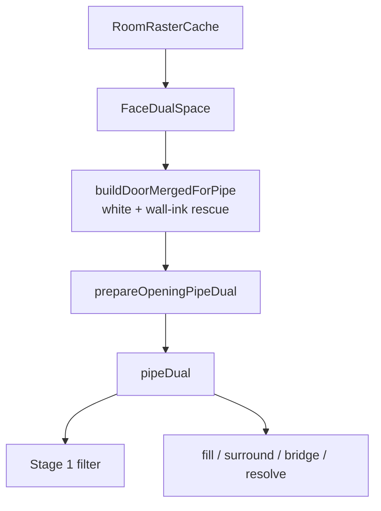

# Deur-detectie flow (stap 3)

Laatste update: 2026-07-26

Doel: herbruikbare inventaris van **hoe** deurdetectie in stap 3 werkt — dual-space faces (opening-wit vs wall-ink), Stage 1–2, clustering, fill, wall-rescue, bridge, resolve, L11/L12 → FML.

Gerelateerd: [`window-detection-flow.md`](./window-detection-flow.md), [`workspace-flow.md`](./workspace-flow.md), [`archive/wall-face-class-flow.md`](./archive/wall-face-class-flow.md), [`floorplanner/door-mirrored-semantics.md`](./floorplanner/door-mirrored-semantics.md).

---

## Verdict (1 min)

Deuren draaien **niet** in de V3 L1–L10 muurpipeline. Ze starten zodra Muren-classify klaar is (`roomClassifyState`), meestal al op de **Muren-tab** in `review`.

Pipeline: `runDoorStagePipeline({ dual })` met **`FaceDualSpace`** van `RoomRasterCache.ensureFaceDualSpace` (of `buildFaceDualSpaceFromState`).

Na merge wall-rescue: **`prepareOpeningPipeDual`** → `pipeDual`. Stages lezen **`pipeDual` + `DOOR_SPACE_POLICY`** (geen parallelle ad-hoc unpack in de UI).

| Concern | Space | Policy-key |
|---|---|---|
| Stage 1 seed/maat | opening-wit | `stage1Measure` |
| Stage 1 cluster-adjacency | wall-ink (wit–inkt–wit) | `stage1ClusterBridge` (= **ink**; white CC’s raken elkaar niet) |
| Wall-rescue match | ink **óf** white (Either) | `wallRescueMatchSpaces` |
| Wall-rescue merge / wall-fill area | wall-ink | `wallRescueMeasure` / `wallFillMeasure` |
| Room-surround | wall-ink adjacency | `surroundLabels` |
| Wall-touch gate | wall-ink adjacency | `wallTouchLabels` |
| Bridge “tussen 2 muren” | wall-ink | `bridgeBetweenWalls` |
| Resolve / overlay paint | wall-ink | `resolvePaint` / `overlayPaint` |
| REF swing-sector | white | `refSwingMeasure` |
| REF framing / blade | ink | `refFramingMeasure` |

Policy-constante: `frontend/src/cv/doors/door-space-policy.ts` (`DOOR_SPACE_POLICY`).

API: `FaceDualSpace` via `ensureFaceDualSpace` (`face-dual-space.ts`); wall-rescue merge blijft `opening-white-space.ts`. REF dual: `ref-face-dual-space.ts` (prefer via gedeelde `pickGeomByPrefer`).

---

## Wanneer draait het?

UI-entry: `useWorkspaceDoorSwingFaces` → `runDoorSwingOverlayRefreshPass` → `runDoorStagePipeline`.

| Conditie | Gedrag |
|----------|--------|
| `flowStep === 'templates'` + `wallsClassifyReady` + `roomPhase === 'review'` + tab `walls` \| `doors` | Auto Stage 1+2 + push `door`-overrides |
| `roomPhase` → `done` / finalizing | Geen nieuwe detectie; alleen `snapResolvedDoorsToWalls` (L11/L12) |
| Snapshot-restore / deur-demote | `existing-doors-only`: alleen bestaande `door`-faces; geen unknown→deur; **angle-rescue wél** voor reeds class=`door` (anders verdwijnen twins zoals face 32 uit overlay/FML) |
| Geen deur-refs / geen refBands | Lege stage-cache; push lege deurset (stale auto-deuren weg bij replace) |

Triggers voor her-detectie (debounce 80 ms): verse classify / reclassify (`replace-all`), ppm-wijziging, deur-ref wijziging (`replace-auto`). **Niet** na Inkt verwerken — deur/raam-pins blijven; angle-rescue draait alleen in die eenmalige deur-pass. Handmatige face-edits na één geslaagde auto-pass **niet**.

---

## Dual-space (wallface vs whiteface)



### Opening-wit (`dual.white` / `buildOpeningWhiteSpace`)

- Components uit `rawLabelsData` (zelfde buffer als pre-ink white CC’s).
- Class per raw label: faceOverrides → border→`outside` → classify (via `priorParentMap` als nodig).
- Roots met `isOpeningWhiteClass`: `surface | outside | unknown | door | window`.
- **`wall` nooit** als Stage-1 strip/sector-maat (tenzij via wall-rescue merge).

### Wall-ink (`dual.ink` / `extractWallInkComponents`)

- Components uit post-ink `labelsData`, gefilterd op class `wall`.
- Bbox/`areaPx` **inclusief** toegewezen inkt — relevant voor gevulde bogen (Otsu-ingekleurd).
- Bij labelconflict wint wall-component (`mergeOpeningWhiteWithWallInk`).

### Pipeline-dual na detach

1. `buildDoorMergedForPipe(dual)` — white parentMap/class + wall-ink rescue components (geen parallelle `OpeningWhiteSpace`-lifecycle).
2. `prepareOpeningPipeDual(dual, merged)` — seed-detach + `rebindFaceDualWhite` → `pipeDual`.
3. Stage 1–2 + resolve lezen `pipeDual` + policy; filter verwacht al gedetachte maps (geen tweede detach).
4. Cluster-adjacency: **deur-only** herbouw `buildLabelAdjacency(inkLabels, detachedWhiteParentMap)` — bewust anders dan raam (`pipeDual.ink.adjacency` as-is). Zie centralization-audit #6 (F tot raam dezelfde semantiek nodig heeft).

### Wat de computation-cache levert

`useWorkspaceDoorSwingComputationCache`:

1. `resolveDual` → `ensureFaceDualSpace` / `buildFaceDualSpaceFromState` (gecached).
2. `resolveRefBands` → `analyzeDoorSwingRef` (apart gecached).
3. Detach/rebind/stages → `runDoorStagePipeline` (pure CV).

Probe toont beide: `wallInkFaces` + `openingWhiteFaces` (`useWorkspaceDebugProbe`).

---

## Stap 2 → ref-band (train-by-example)

Refs worden in stap 2 getekend; analyse gebeurt bij elke Stage-pass:

`analyzeDoorSwingRef` (`door-swing-ref.ts`):

1. **`runRefStages`** — zelfde pad als stap-2 rapport: wallLayer-crop → face-crop → **`straightenRefLast`** (90° bij verticaal + swing naar onder) = figuur «Rechte face-crop».
2. Op die rechte crop: `labelWhiteFaces` → witte CC’s + `RefFaceDualSpace`.
3. Swing-face via `selectSwingSectorFace`: kopeinde-zone **`below`** eerst, dan score-rank; full-width kamerblob wijkt voor smallere wedge. Maat op **white** (`DOOR_SPACE_POLICY.refSwingMeasure`).
4. Hinge uit sector-mask; sizing (framing / overhang / ratioBlade) op **ink** faces (`refFramingMeasure`).

Niet meer: ruwe crop + alleen 180° — dat liet verticale deuren stil uit `refBands` vallen terwijl het rapport ze wél toonde.

Niet: “grootste white in de crop” — dat gaf Project4 Otsu-deur foutief `166×39 / area 4915` i.p.v. de echte boog (~1072).

Output `DoorSwingRefBand` (kernvelden):

| Veld | Rol later |
|------|-----------|
| `swingWpx` / `swingHpx` / `aspectRef` | Aspect-match Stage 1 |
| `swingSpanPx`, `wallRatio`, `depthRatio` | Gericht cluster-target + size-band per as |
| `areaPx`, `areaSpan2Ratio` | Fill-verwachting / wall-rescue area |
| `framing*`, `overhang*`, `clearOverhang*Ratio`, `ratioBlade` | Resolve → openingbreedte |
| `swingAngleDeg` | As-scheiding hinge (kast 30° vs standaard 90°) |
| `fmlRefId` / `kind` | FML template |

Absolute mm-band (muur-as only): `resolveDoorSizeBandPx` → 250–1200 mm → px via ppm. **Diepte** komt uit de ref (± relax), niet uit DOOR_MIN/MAX.

---

## End-to-end pipeline (één refresh-pass)

Orde in `runDoorSwingOverlayRefreshPass` → `runDoorStagePipeline`:

```
1. resolveRefBands(deur-rects)
2. resolveDual → FaceDualSpace
3. buildDoorMergedForPipe → white + wall-ink rescue
4. prepareOpeningPipeDual → pipeDual (detach + white rebind)
5. runDoorSwingFilter (**ink** cluster-adjacency; detach al via prepareOpeningPipeDual) → Stage 1
6. buildWallRejectedFillCandidates → wall-fill extras
7. mergeHypothesesForFillStage → Stage1 ∪ unclaimed wall-fill
8. runDoorFillFilter → fill ±20% t.o.v. ref
9. filterRoomSurroundedHypotheses → drop als alle ink-adjacent room/unknown of wall
10. runDoorSwingAngleRescue → inject (bypass fill/surround)
11. filterWallUntouchedHypotheses → drop zonder ink-adjacent wall/window/doorframe
12. findDoorBridgeWallFaces → surface/unknown “brug” (ink labels tussen muren)
13. resolveDoorCandidates → span, width, fmlRefId (**geen hinge**)
14. pushStage2DoorsOntoWalls → faceOverrides door + bridge doorframe
15. overlay render → Deuren-tab; pipeDual.ink labels
```

Na afronden muren (L0 keepLargest → `roomWallMaskRle` + L10 + segments):

```
16. filterDoorsByKeptWallMaskContact → drop zonder kept-mask contact; unpin auto-door
17. snapDoorsToWalls   → BoundDoor (L11; geen hinge-score)
18. orientBoundDoors → L12 hinge (white straighten) → OrientedDoor
19. useWorkspaceFml    → layer12Doors → FML openings
```

---

## Stage 1 — seeds, match, cluster (`runDoorSwingFilter`)

Bestand: `door-swing-filter.ts` + `door-swing-filter-matching.ts`.

### RootFaces

`aggregateRootFaces`: per merged root som `areaPx` + union bbox + hoogste class-priority (`wall/window > door > unknown > surface > outside`).

Components zijn dual-space: whiteface-geometrie voor opening-classes; wallface-geometrie waar class `wall` is ingevoegd.

### Seed-gate (`resolveSingleMatch`)

| Class | Mag seed? |
|-------|-----------|
| `surface` / `unknown` / `outside` / `door` / `window` | Ja (size/aspect filtert mega-exterior) |
| `wall` | Alleen via **wall-rescue Either** — ink **óf** white geom (`wallRescueMatchSpaces`); `isWallRescueCandidate` (area vs span² + fill-band) |

Opening-wit contract: wall is geen normale Stage-1 seed; merge blijft ink-components (`wallRescueMeasure`), match probeert ink→white tot één past.

Match-volgorde per seed×ref:

1. Strikte aspect + ref-gebonden size-band (`bestAspectRef` / `fitsSizeBandForRef`)
2. Clipped-arc rescue (niet-wall; langgerektere boog, fill/area checks)
3. Wall-rescue Either / size-near / shallow-under-min (wall: ink→white; non-wall: undersized)

### Clustering

- Refs gesorteerd **grootste `areaPx` eerst** — grote boog claimt stroken vóór kleinere ref.
- Per seed × **één** scoped ref: `evaluateSeedForRef`.
- **Single** die al matcht: absorbeer in-band buren; als undersized t.o.v. ref-bbox (`< 0.55×`), probeer `growClusterForRef`.
- **Geen single**: `growClusterForRef` — greedy buren die underfill t.o.v. **echte** ref-target verlagen; max overshoot 1.2×; score = beste aspect/fill-match (niet grootste union).
- **Absorb** na accept: kleine buren (`≤ 0.5×` union-area) zolang zelfde ref nog matcht (aspect +8% bonus).
- Clusterable faces: niet-wall, tenzij `allowedSeedClasses` (restore: alleen `door`).
- **Ink-bridge buren:** `collectNeighborsViaWallInkBridge` (`walls/rooms/wall-ink-bridge.ts`) — wit–inkt–wit hop, mid = `isWallMaskClass`; zelfde hop als raam Stage-1. Greedy/absorb blijft lokaal.
- Dedupe: zelfde face-set + ref → één hypothese; kleinere ref mag alleen claimen als ≥1 **nieuw** vlak.

Diagnostiek per root: `accepted_single` | `accepted_cluster` | `rejected_outside_or_wall` | `rejected_out_of_band_or_aspect` | `rejected_cluster_no_match`.

`filledAreaPx` op hypothese = som `areaPx` van faceIds (white of wall-ink, afhankelijk van welke component in de merge zat).

---

## Stage 2 — fill, surround, angle-rescue, wall-touch, bridge

### Wall-fill pass A (`door-swing-fill-stage.ts`)

Diagnostics met `rejected_outside_or_wall` **én** `className === 'wall'`: opnieuw size+ruimere aspect (18%) via `wallRescueMatch` — **zonder** area/fill-abs. Die kandidaten gaan naar de fill-filter; Stage-1 wall-rescue blijft strikt.

### Fill-filter (`runDoorFillFilter`)

`candidateFill = filledAreaPx / (bbox.w × bbox.h)` vs `refFill` × **[0.8, 1.2]**. Te leeg / te vol → reject. Dit is de ink-compare die wall-fill beslist (dichte Otsu-boog vs ijle white stroken).

### Room-surround (`filterRoomSurroundedHypotheses`)

**Ink-adjacency only** (zelfde graph als Stage-1 cluster-brug): alle neighbors van de
hypothese-faceIds. Geen white labels, geen bbox-rays.

Reject als alle adjacent faces:

- dezelfde `surface`-room en/of `unknown` zijn, of
- `wall` zijn.

Echte deur: wall + room adjacent → blijft. Kast-FP: alleen wall-buren → weg.
Doorframe bestaat tijdens deur-pass nog niet (dan nog `wall`).

### Angle-rescue (`door-swing-angle-rescue.ts`)

Na fill+surround, **vóór** wall-touch/bridge/resolve: scan **alle** dual-roots (niet alleen Stage-1 rejects).

| Gate | Regel |
|------|--------|
| Ref | `swingAngleDeg` gezet **én** `< 60` (geen 90°-refs) |
| Hoogte | `depthRef = min(swingWpx, swingHpx)`; `min(w,h)` van **ink óf white** ∈ ±20% |
| Lengte | `max(w,h) ≤ sizeBand.wallMaxPx` (absolute 1200mm-band) |
| Fill | `area/(w×h) < 0.80` (geen aparte too_full-vs-ref; hinge beslist) |
| Breedte | verder genegeerd (alleen max-lengte hierboven) |
| Hoek | altijd **white** (ink-fallback alleen zonder white-geom); `expectedAngleDeg` + H/V-prefer uit bbox; `abs(cand − ref) ≤ 10°` |
| Meet-space | white wanneer beschikbaar (`angleRescueMeasurePrefer`) |

Matches → hypotheses `source: 'angle_rescue'`, **bypass** fill/surround (niet wall-touch), daarna in de wall-touch-poel. Snapshot `existingDoorsOnly` → alleen reeds `door`-classes (`allowedClasses`). Dichte Stage-2 `too_full` blijft afgekeurd.

### Wall-touch (`filterWallUntouchedHypotheses`)

**Ink-adjacency only** (zelfde graph als surround). Ná surround + angle-rescue.

Keep als ≥1 adjacent root `isWallMaskClass` is (`wall` / `window` / `doorframe`).
Anders reject `no_wall_touch` — losse / meubel-achtige bogen zonder muur-buur.

Geen wall-mask merge / keepLargest; geen wijziging aan V3. `existingDoorsOnly` → gate overgeslagen.

Rapport (`*-deuren-fase1-report`): `stage2.fillRejected` / `surroundRejected` / `wallTouchRejected` / `angleRescueDiagnostics` met status + fill/diepte/lengte/hoek — zodat gemeten rejects een reden hebben.

### Bridge-wall (`findDoorBridgeWallFaces`)

Na accept: surface/unknown faces die:

- deur raken via **adjacency** (opening-wit),
- span ≈ deurspan (±15%), korte as ≤ max(deur-diepte×1.5, muurdikte×2),
- cardinaal **tussen twee wall**-buren (check op **post-ink** `labelsData`),

→ BFS naar in-band buren → later `syncDoorBridgeWallOverrides` (class **`doorframe`**, mask≡wall). Zo wordt de opening-koker in het muurmasker meegenomen zonder de boog zelf; UI = donker oranje kozijn.

### Wall parentMap claim (na classify + Stage push)

Na wallish-erfenis claimt de muur-pass enclosed children met `claimFacesFromParentMap` (`face-parent-claim.ts`) — FaceID = raw label, class blijft wallish; **geen** nieuwe parentMap. Seed-detach blijft lokaal (opening-wit kopie). Bij `pushStage2DoorsOntoWalls` claimen accepted deur- + bridge-`faceIds` opnieuw via `claimFacesInRoomRasterCache` (anders 198→14 onzichtbaar in wall-ink adjacency).

---

## Resolve → L11 → L12 → FML

### Resolve (`resolveDoorCandidates`)

Gebruikt **post-ink** `labelsData` + Stage-2 faceIds:

- Arc-centroid over pixels van die faces.
- **Geen hinge** — scharnier komt pas in L12 na wall-bind.
- `swingSpanPx` uit unie-bbox.
- Openingbreedte: clear overhang × schaal + vaste framing → `widthPx` / `widthCm`.
- Geen drop meer bij ontbrekende hinge (vroeger hard gate).

### Post-L0 — kept-wall-mask contact (`filterDoorsByKeptWallMaskContact`)

Na finalize bestaat `roomWallMaskRle` (grootste wall-blob na morph-close). Early Stage-2 wall-touch
keek alleen naar face-class `wall|window|doorframe` — inclusief speckles die L0 dropt.

Vóór L11 in `snapResolvedDoorsToWalls` (en fase1-export):

1. Keep alleen resolved deuren waarvan een face-pixel (raw óf merged root) de kept mask
   raakt binnen radius `max(4, round(thickness×0.2))`.
2. Reject `no_kept_wall_mask_contact` → uit `resolvedDoors` / stage-cache.
3. Auto-`door` pins van orphans: `syncDoorSwingFaceOverrides` met kept faceIds
   (base class terug; geen force-`surface`).
4. Geen wall-face demote / geen Stage-2 her-run.

### L11 — `snapDoorsToWalls`

Alleen deuren die nog class `door` zijn **én** de post-L0 kept-mask filter haalden.

Binding-score: contact/proximity/segment — **geen** hinge-distance penalty (hinge bestaat pas in L12).

Vóór snap: `attachDoorframesToResolvedDoors` — **alleen directionele ink-adjacency** (1-hop deur→doorframe zet L/R/U/D; verdere hops alleen in die richting). Geen bbox-near. Window-pass → `reattachStickyDoorframesToResolved`. Cluster-kozijnen in `faceIds` → peel naar `doorframeFaceIds`.

**Path A (doorframe-first):**

1. Explicit `door.doorframeFaceIds` → unie-bbox
2. Anders directionele ink-adjacency (1-hop + grow alleen in die richting)
3. Anders as-gerichte multi-hop grow (`wall`/`doorframe` frontier, hop-cap 8, perp-band)
4. Segment-first bind langs kozijn (geen wallMask-gate) → anders wallMask met verlengde span
5. Zet `doorframeClearOpening` (deurblad/clear op segment); `snappedBBox` langs muur = clear + REF framing

**Path B (muur, dual/ink):** primair = gemergde `faceIds`-swing-mask (`paintSwingFaceMask`) → side-contact t.o.v. wallMask én adjacent wall-bboxes → segment-bind (as uit contact, niet wall-union `dfH≥dfW`). Verwerp segmenten te ver van deur-centroid. Fallback: oude wall-union aspect-bind / wallMask-span / legacy deur-bbox.

Bridge: promote `surface|unknown` → `allFaceIds` + `byHypothesisId`; **sticky** `doorframe`-buren alleen → `byHypothesisId` (geen re-promote). Pipeline-attach + window-callback vullen resolved `doorframeFaceIds`.

### L12 — `orientBoundDoors`

1. **Hinge:** white `faceIds`-mask (tight AABB na peel) → bij multi-face cluster: directional `MORPH_CLOSE` op wit (dicht inktgaten tussen stroken → één sectorcontour) → muur H + swing onder → `computeDoorHingeFromMask` (`preferredWallAxis: 'h'`, geen angle-prior; zelfde als REF) → floor (`door-l12-hinge.ts` / gedeelde `door-swing-mask.ts`). Bron: `rawLabelsData` / pipeDual.white. Faal → deur niet in FML.
2. Opening- vs blad-as t.o.v. muur; `mirrored`; kozijn-tot-kozijn (`openingStart/End`) vs clear display-span.

- **Met `doorframeClearOpening` (Path A):** L11-uiteinden = **deurblad**. FML `openingStart/End` = die uiteinden **+ REF framing** (naar buiten langs freeDir). Display = clear blad (kozijnen zichtbaar). Geen rebuild vanaf hinge-only swing-overhangs.
- **Zonder (Path B):** resolve-overhangs → `resolveFramedOpeningAlongWall` vanaf L12-hinge.

### FML

`useWorkspaceFml` → `toLayer12DoorForFml` → `extractionToPlan` `layer12Doors`. Overlay toggles: `showLayer11` / `showLayer12`.
Path A: FML-breedte = deurblad (doorframe) + REF framingAlong/Opposite.
---

## Face-class push & finalize

| Actie | Effect |
|-------|--------|
| `syncDoorSwingFaceOverrides` | Stage-2 faceIds → `door` (amber); vorige auto-set vervangen bij classify/refs |
| `syncDoorBridgeWallOverrides` | Stage-2 bridge faces → class `doorframe` (sticky; geen auto-remove van doorframe) |
| `syncDoorframeFaceOverrides` | Stage-3 kozijn → `doorframe` (**sticky**: geen auto-remove; nooit terug naar window) |
| Finalize muren | `toWallPipelineClass`: `door` → `unknown` in mask; `doorframe`/`window` → wall in mask |
| V3 L1–L10 | Ziet binary mask; geen face-class |
| L11/L12 | Openings op segmenten, los van mask-blobs |

Tot afronden is `door` UI/Stage-2-metadata. Geen ink-reresolve bij deur-push (bogen blijven buiten muurmasker). Window-push sluit bestaande `doorframe`-pins uit.

---

## Modulekaart

| Module | Rol |
|--------|-----|
| `ui/.../useWorkspaceDoorSwingFaces.ts` | Orchestratie, auto-pass gate, overlay, snap |
| `ui/.../useWorkspaceDoorSwingComputationCache.ts` | Floor dual + REF-bands cache |
| `ui/.../useWorkspaceDoorSwingHelpers.ts` | Stage-cache, signatures, stats |
| `cv/doors/door-space-policy.ts` | `DOOR_SPACE_POLICY` |
| `cv/doors/run-door-stage-pipeline.ts` | Pure CV: merge → `prepareOpeningPipeDual` → Stage 1–resolve |
| `cv/walls/rooms/opening-pipe-dual.ts` | Bootstrap: seed-detach + white rebind → `pipeDual` |
| `cv/walls/rooms/opening-white-space.ts` | Opening-wit + wall-ink merge helpers |
| `cv/walls/rooms/wall-ink-bridge.ts` | Wit–inkt–wit hop (Stage-1 cluster-brug; gedeeld met ramen) |
| `cv/doors/door-swing-ref.ts` | Ref → `DoorSwingRefBand` (orient bottom + `selectSwingSectorFace`) |
| `cv/refs/ref-swing-arc.ts` | `selectSwingSectorFace` / zone-`below` + full-width reject |
| `cv/refs/ref-straighten.ts` | `orientDoorBwSwingToBottom` (LBE 180°) |
| `cv/walls/rooms/opening-seed-detach.ts` | ParentMap seed-detach (tijdelijke Stage identity) |
| `cv/walls/rooms/label-adjacency.ts` | 8-connect root-graph |
| `cv/doors/door-swing-filter.ts` | Stage 1 entry (`runDoorSwingFilter`; detach-owner = pipe-dual) |
| `cv/doors/door-swing-filter-cluster.ts` | Stage 1 cluster grow / absorb |
| `cv/doors/door-swing-filter-seed.ts` | Stage 1 seed match + wall-rescue Either |
| `cv/doors/door-swing-filter-matching.ts` | Tuning, match, wall-rescue, aggregate |
| `cv/doors/door-swing-fill-stage.ts` | Wall-fill kandidaten |
| `cv/doors/door-fill-filter.ts` | Stage 2 fill-band |
| `cv/doors/door-swing-angle-rescue.ts` | Stage 2 angle-rescue + per-root diagnostics (fill/lengte/hoek) |
| `cv/doors/door-room-surround.ts` | Room-surround + wall-touch reject |
| `cv/doors/door-kept-wall-mask-contact.ts` | Post-L0 kept-mask contact purge |
| `cv/doors/door-bridge-wall-promote.ts` | Bridge → wall |
| `cv/doors/door-resolve.ts` | Stage-2 width/meta (geen hinge) |
| `cv/doors/door-wall-snap.ts` | L11 entry `snapDoorsToWalls` (geen hinge-score) |
| `cv/doors/door-wall-snap-*.ts` | L11 split: tuning / geom / scoring / bind / doorframe / path-b |
| `cv/doors/door-attach-doorframes.ts` | Pre-L11: merge sticky doorframe → resolved |
| `cv/doors/door-swing-mask.ts` | Gedeelde faceIds-mask (paint/trim/close) + L11 side-contact |
| `cv/doors/door-l12-hinge.ts` | L12 hinge: white straighten + mask hinge |
| `cv/doors/door-wall-orient.ts` | L12 hinge + mirrored/FML |
| `cv/doors/door-swing-overlay.ts` | Preview-mask |
| `cv/doors/door-scale-band.ts` | Absolute mm→px muur-as |
| `ui/.../useWorkspaceFml.ts` | L12 → FML |

Niet actief: `src/archive/openings/**`.

---

## Invarianten (niet breken)

1. Stage 1 **meet** op opening-wit; wall alleen via rescue/fill met wall-ink geometrie.
2. Adjacency/cluster-bruggen op **ink** labels (`stage1ClusterBridge`, wit–inkt–wit via `wall-ink-bridge`); bridge “raakt deur” op **white** adjacency; bridge “tussen twee muren” op **post-ink** labels.
3. Resolve / overlay / L11 pixel-lookups: **post-ink** `pipeDual.ink.labelsData` + Stage-2 faceIds.
4. `tabOutputs` deur-classes alleen via Stage-2 push (niet in geometry-pipeline OCR).
5. Bij afronden: geen Stage-2 herstart; alleen L11/L12 van reeds geaccepteerde `door`-faces.
6. Ref-crops = wallLayer-B/W; sector = white (`refSwingMeasure`); framing = ink (`refFramingMeasure`).
7. `prepareOpeningPipeDual` (één detach + white rebind); Stage 1 filter zonder tweede detach.

---

## Tuning-anker

`DOOR_SWING_TUNING` in `door-swing-filter-matching.ts` — aspect 5%, max cluster 10, grow overshoot 1.2, wall-fill aspect 18%, wall-rescue area/fill, clipped-arc, absorb 0.5×, undersized-single 0.55×. Wijzig bewust; regressies op BouwTek11 / De Roemer / Project4.

---

## Handmatige checklijst

- [ ] Project4 / BouwTek11: Stage 1 hits op white sectors, niet op pure ink-banen
- [ ] Wall-fill: Otsu-gevulde boog komt door fill-band, niet via versoepelde Stage-1 area
- [ ] Cluster: gestapelde stroken → één boog; dubbele deur niet opgeblazen door tip-face
- [ ] Bridge: koker tussen muren → `doorframe`; boog blijft `door`
- [ ] Afronden: L11 bound + L12 oriented; FML download met juiste `mirrored` / width
- [ ] Snapshot-restore: geen unknown→deur; overlay herbouwt uit bestaande `door`
