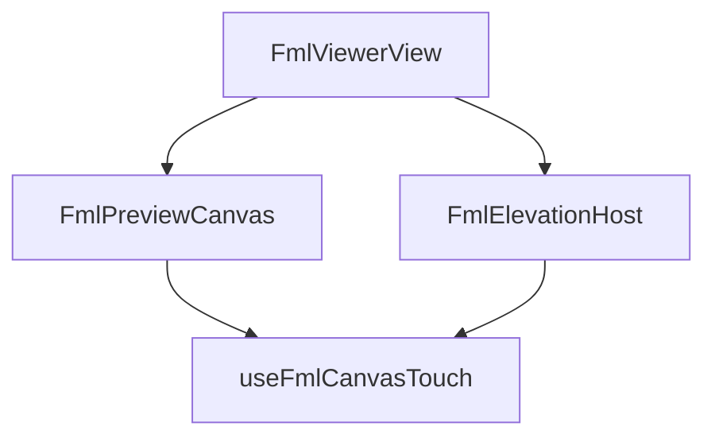

# Lean rapport — FML editor / viewer / elevation — 2026-08-22

## Meta

| Veld | Waarde |
|------|--------|
| Cluster | Stap 4 FML editor (plan + gevels + dak + maten + touch) |
| Scope-paden | `fml-preview/**`, `FmlPreview*`, `FmlElevation*`, `FmlViewerView`, `core/fml` elevation/ridge/dims |
| Status | **B1–B8 VERBETER** (campagne na product-afronding) |
| Bron-refactor | [`fml-editor-viewer-2026-08-18.md`](./fml-editor-viewer-2026-08-18.md) · ronde 10–12 |
| Gerelateerde docs | workspace-flow, door-mirrored-semantics, decisions (dak/gevels/maten) |
| Campagne-plan | `.cursor/plans/fml_lean_touch_e0de74d4.plan.md` |

## Samenvatting

- Lean 18 aug is uitgevoerd; daarna groeiden hosts weer (gevels, nok/dakvlak, slicer, glyphs, packed bovenlicht, stempel).
- Eindbeeld: **twee hosts, één primitive-set** (touch, opening-velden, viewport). Tool-IDs hergebruikt (nok = `draw_wall`+ridge; dakvlak = `draw_surface`+`dakMode`).
- Grootste risico’s: ElevationHost (2291) eigen pointer/undo; Canvas touch+slicer inline; ViewerView (2503) mode-shell.

## INDEX

| Pad | ~Regels | Rol | Owners |
|-----|--------:|-----|--------|
| `FmlViewerView.vue` | 2503 | viewer host | gevels/dak/maten/load/defaults |
| `FmlElevationHost.vue` | 2291 | elevation editor | eigen undo + pointer |
| `FmlPreviewCanvas.vue` | 2015 | plan wire-up | touch-loop + slicer-handles |
| `useFmlPreviewInteraction.ts` | 1744 | orchestrator | dak/nok snap + tool wiring |
| `useFmlPreviewEditor.ts` | 1154 | plan-mutate API | ridge/roof/stamp/slices |
| `facade-elevation.ts` | ~905 | projectie + types | paint/hit siblings |
| `elevation-paint.ts` | ~179 | vlakken + baksteen-ringen | Host render |
| `elevation-hit.ts` | ~375 | hit/snap/split/patch | Host pointer |
| `useFmlPreviewWallSelection.ts` | 670 | wall/junction drafts | stamp/facade |
| `useFmlPreviewPointer.ts` | 519 | pointer router | sticky + touchNav |
| `fml-preview-touch-tap.ts` | 51 | tap / hover-follow / hold-drag | Canvas |
| `fml-preview-gestures.ts` | 81 | pinch/pan math | Canvas + Elevation chrome |
| `FmlOpeningAddToolFields.vue` | ~135 | add-deur/raam strip | plan + elevation |

## Call-flow (kort)

- `/FML-editor`: ViewerView kiest FmlEditor (plan, optioneel `dakMode`) of FmlElevationHost (`gevelsMode`) of FmlInspect.
- Plan: Canvas → Editor + Viewport + RenderModel + HitTest + Interaction → Pointer → Draw*/Drag*/Measure.
- Elevation: Host eigen pointer + `elevation-openings` / `elevation-opening-edit` / `facade-elevation` + `elevation-paint` + `elevation-hit`; viewport/panzoom/underlay gedeeld.
- Touch (plan): coarse MQ + `useFmlCanvasTouch` → synthetische mousedown + hover-follow / hold-drag / pinch.
- Opening add: gedeelde `FmlOpeningAddToolFields`; edit via `FmlOpeningEditFields`.

## Snap-tabel (W — niet unificeren)

| Const | cm | Betekenis |
|-------|---:|-----------|
| `JUNCTION_POINT_SNAP_CM` / `ENDPOINT_SNAP_RADIUS_CM` / `WALL_FACE_SNAP_CM` | 15 | plattegrond knoop/face |
| `OUTER_FACE_SNAP_CM` / `SLICE_OFFSET_SOFT_SNAP_CM` | 15 | buitenface / slicer soft |
| `ROOM_DRAW_END_SNAP_CM` | 8 | kamer 2e hoek H/V |
| `OPENING_DRAG_SNAP_CM` | 8 | opening naar andere muur |
| `DAK_FACE_SNAP_CM` / `ROOF_TOUCH_SLACK_CM` | 8 | dakvlak face |
| `ELEVATION_*_SNAP_CM` (opening/split/roof-Z/same-plane/junction-hit) | 8 | aanzicht |
| `DAK_CORNER_SNAP_CM` | 5 | dakvlak hoek |
| `ROOM_DRAW_SNAP_CM` | 4 | kamer-start hartlijn |
| `MANUAL_DIM_FACE_SNAP_CM` | 60 | handmatige maat oneindige as |
| `DEFAULT_SLICER_OFFSET_SNAP_CM` | 50 | P↔P offset |

Zelfde getal ≠ zelfde contract. Rapport-tabel is de owner; geen `SNAP_TIGHT_CM`.

## Touch-matrix

| Tool | Plan coarse | Elevation |
|------|-------------|-----------|
| `draw_wall` / nok | hover-follow (zelfde id) | n.v.t. / kopse nok = hold-drag na B6 |
| `draw_surface` / dakvlak | hover-follow; sluiten dblclick (B8 gedrag) | vertex-Z hold-drag na B6 |
| `add_door` / `add_window` | hover-follow | hover-follow na B6 |
| `split` | toolbar / Ctrl | hover-follow na B6 |
| `measure` tape/manual | hold-drag | n.v.t. |
| slicer P/M | hold-drag na B4 | n.v.t. |
| nulpunt / box_select | hold-drag | n.v.t. |
| select/sleep | sticky + `moveMod` | hold-drag na B6 |
| Workspace stap-4 | **F** `touchChrome=false` | geen gevels |

Modifier-rail (plan) is bewust alleen select/meet — F. Elevation gebruikt eigen toolbelt (deur/raam/split).

## Findings

### I — Inline duplicaat

| Item | Locaties | Owner | Batch |
|------|----------|-------|-------|
| Touch-loop ~200 r | Canvas only | `useFmlCanvasTouch` | B2 |
| Opening-edit UI | ToolbarSettingsOpening / ElevationFields / QuickFields | `FmlOpeningEditFields` | B3 |
| Slicer P/M-handles | Canvas inline | measure/slicer composable | B4 |
| `pointerCm` + window-drag | ElevationHost ×5 | `useFmlElevationInteraction` | B5 |
| `placeOpening` vs AddOpening | Host / `useFmlPreviewAddOpening` | `buildOpeningFromPreset` | B3/B5 |
| `windowPanelCount` | elevation-symbol / opening-render | kleine helper | B3/B8 |

### R — Redundant werk

| Item | Waar | Behoud | Batch |
|------|------|--------|-------|
| Underlay layout ternary | ViewerView ~10× | `useFmlViewerGevels` | B7 |
| Elevation undo vs editor | twee hosts, `v-if` | **F** niet mergen | — |

### W — Wet variant

| A | B | Consolideren? | Batch |
|---|---|---------------|-------|
| 8 cm snaps | 6 named consts | Nee — tabel hierboven | B1 F |
| Hinge/swing knoppen | plan vs elevation | Ja via EditFields | B3 |

### O — Over-abstractie

| Wrapper | Actie | Batch |
|---------|-------|-------|
| Interaction plat return | F — niet nesten | — |
| Thin Draw* composables | OK | — |

### C — Verkeerde home

| Logica | Nu in | Hoort in | Batch |
|--------|-------|----------|-------|
| Touch + slicer | Canvas | `useFmlCanvasTouch` / measure | B2/B4 |
| Gevels/dak/maten | ViewerView | `useFmlViewer*` | B7 |
| Dak/nok resolvePoint | Interaction | snap-helper | B8 |
| `splitWallAtT` import | `elevation-openings` → UI | core of UI-caller | B5 |

### N — Inconsistente vorm

| Concern | Varianten | Canoniek | Batch |
|---------|-----------|----------|-------|
| Elevation tools | `ElevTool` vs `FmlToolId` | `FmlToolId` + `split` | B5/B6 |
| Add-drafts in selection refs | `fml-preview-selection` | F tenzij B3 dwingt | — |

### F / P — bewust

| Item | Reden |
|------|-------|
| `touchChrome` alleen editor | workspace/inspect F |
| Plan ≠ elevation undo | hosts wisselen |
| Plan-glyphs ≠ elevation-glyphs | andere ruimte; catalogus deelt `frame` |
| Nok- vs plan-junction-graaf | nok niet in plattegrond-topologie |
| Product-gates | area/surface/orient/frame-edit UI |
| `FML_OPENING_FRAME_EDIT_VISIBLE` | `btfFrame` klaar, UI uit |

## Batches

1. **B1** — dit rapport + touch-tap comment (geen gedrag)
2. **B2** — `useFmlCanvasTouch` uit Canvas
3. **B3** — `FmlOpeningEditFields`
4. **B4** — slicer uit Canvas
5. **B5** — `useFmlElevationInteraction` + core→UI split-knip
6. **B6** — Elevation + `useFmlCanvasTouch` (geen plan-ModifierRail forceren)
7. **B7** — Viewer gevels/dak/maten
8. **B8** — dak/nok snap-helper; geen Interaction-package

## Niet doen (deze ronde)

- God-split Canvas/Editor/facade-elevation om regels
- Detectie-tuning / L6 / `baseline.ts`
- Elevation-undo mergen met `useFmlPreviewEditor`
- 8 cm tot één const
- Glyph-pijplijnen mergen
- Workspace touch aanzetten

## Verificatie

- [x] `npm run build` (na B8)
- [x] gerichte vitest: gestures, sticky-select, slice-offset-snap, facade-elevation, elevation-opening-edit, dak-draw-snap
- [ ] UI-smoke: plattegrond nok/dakvlak/slicer; gevels plaats/sleep/split; coarse na B6 (handmatig)

## Log

| Datum | Fase / Batch | Resultaat |
|-------|--------------|-----------|
| 2026-08-22 | INDEX/DOCUMENT | inventaris; batches B1–B8 |
| 2026-08-22 | B1 | rapport + `isTouchHoverFollowTool` comment/`split` |
| 2026-08-22 | B2 | `useFmlCanvasTouch` uit Canvas |
| 2026-08-22 | B3 | `FmlOpeningEditFields` + `resolveWindowPanelCount` |
| 2026-08-22 | B4 | `useFmlPreviewSlicer` + `snapSliceHandleAxis` |
| 2026-08-22 | B5 | `buildOpeningFromPreset` + `splitPlanWallAtT` knip + pointer |
| 2026-08-22 | B6 | ElevationHost + `useFmlCanvasTouch` (geen plan-ModifierRail) |
| 2026-08-22 | B7 | `useFmlViewerGevels` / `Dak` / `Dimensions`; underlay-ternary weg |
| 2026-08-22 | B8 | `fml-preview-dak-draw-snap.ts`; geen Interaction-package / geen `createPendingDrag` (4 px nog 2×) |
