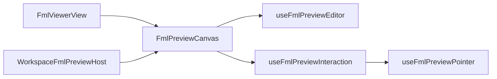

# Lean rapport — FML editor / viewer — 2026-08-18

## Meta

| Veld | Waarde |
|------|--------|
| Cluster | 1 — FML editor/viewer (hoogste prioriteit) |
| Scope-paden | `fml-preview/**`, `useFmlPreviewEditor`, `FmlPreview*.vue`, `FmlViewerView.vue` |
| Status | **B1–B5 VERBETER done** (B4 = F doc; gates behouden) |
| Bron-refactor | [`stap4-fml-2026-07-28.md`](./stap4-fml-2026-07-28.md) · ronde 10–12 |
| Gerelateerde docs | fml-inspect-pwa, areas/surfaces product-gates |

## Samenvatting

- Preview-lagen (editor-store, hit-test, selection, stage-Vue’s) zijn gezond; **orchestratie is opnieuw volgelopen**.
- God-orchestrator = `useFmlPreviewInteraction` (~1155), niet `useFmlPreviewEditor` (~591).
- Hosts: `FmlViewerView` (~1714), `ToolbarSettings` (~1057), `Canvas` (~1021).
- 6 concrete lean-seams (zie plan); diepte **B**; geen gedrags-/gate-wijziging.

## INDEX

| Pad | ~Regels | Rol | Owners |
|-----|--------:|-----|--------|
| `FmlViewerView.vue` | 1714 | viewer host | load, defaults, inspect, orient, design, rescale |
| `useFmlPreviewInteraction.ts` | 1155 | orchestrator | ~110 return-keys; wires ~15 composables |
| `FmlPreviewToolbarSettings.vue` | 1057 | toolbelt settings UI | wall/opening/area/surface/label |
| `FmlPreviewCanvas.vue` | 1021 | wire-up shell | editor+viewport+render+hit+interaction |
| `useFmlPreviewEditor.ts` | 591 | plan-store / mutate API | walls/areas/surfaces/labels/undo |
| `useFmlPreviewOpeningSelection.ts` | 543 | opening field drafts | draft-commit |
| `useFmlPreviewWallSelection.ts` | 505 | wall/junction drafts | draft-commit |
| `useFmlPreviewPointer.ts` | ~419 | pointer dispatcher | edit vs inspect |
| `useFmlPreviewHitTest.ts` | ~268 | hit surface | één owner — gezond |
| `useFmlPreviewAreaSelection.ts` | ~217 | area roomtype/name/color | |
| `fml-preview-draft-commit.ts` | ~136 | debounce 700 ms + flush | wall+opening+area |
| `fml-inspect.ts` | ~92 | pick priority + demo colors | inspect only |
| Stage-Vue’s (Areas/Surfaces/…) | klein | presentational | |
| `WorkspaceFmlPreviewHost.vue` | klein | workspace canvas + gates | `areaSurfaceEditEnabled=false` |

## Call-flow (kort)

- Workspace: Host → Canvas → Editor + Viewport + RenderModel + HitTest + Interaction.
- Viewer: `FmlViewerView` (load/defaults/inspect/orient) → zelfde Canvas.
- Interaction composeert selection/draw/drag/measure/nulpunt/underlay + Pointer + draftCommit.
- Inspect: `pickInspectTarget` (opening → surface¬cutout → wall → area); edit-pick in Pointer anders geordend.
- Field commit: draft → `schedule` → debounce/flush-on-leave → editor mutate + undo group.

## Findings

### I — Inline duplicaat

| Item | Locaties | Owner-voorstel | Batch | Risico |
|------|----------|----------------|-------|--------|
| Numeric field session (beginUndo → schedule → flush → endUndo) | WallSelection ×4 fields · OpeningSelection ×5 | helper boven `fml-preview-draft-commit` | B3 | mid |
| HitTestApi / modes interfaces | Interaction · Pointer · per-tool | één gedeeld type-module | B1 | laag |
| Inspect color / fill resolve | al in `fml-inspect` | OK | — | — |

### R — Redundant werk

| Item | Waar (dubbel) | Behoud-pad | Batch | Risico |
|------|---------------|------------|-------|--------|
| Pick-prioriteit inspect vs edit | `pickInspectTarget` vs Pointer pointerdown | één ordered picker of documenteer F | B4 | mid |
| Edit-hover mist area/surface | Pointer RAF alleen junction/opening/wall | uitbreiden of F (inspect-only hover) | B4 | laag |

### W — Wet variant

| Locatie A | Locatie B | Consolideren? | Batch | Risico |
|-----------|-----------|---------------|-------|--------|
| Viewer session-defaults | Workspace floor-defaults + regenerate | **Nee** — F | — | — |
| Viewer orient UI | Workspace `FML_ORIENT_*` gated | **Nee** — twee hosts, zelfde `floor-plan-orient` | — | — |

### O — Over-abstractie

| Wrapper | Actie | Batch |
|---------|-------|-------|
| Thin Draw* composables | OK — niet inklappen | — |
| `useFmlPreviewEditor` als “orchestrator” | is plan-API; niet verder abstraheren | — |

### C — Verkeerde home

| Logica | Nu in | Hoort in | Batch | Risico |
|--------|-------|----------|-------|--------|
| Inspect pick/hover + keyboard glue | Interaction | `useFmlPreviewInspect` (+ keyboard module) | B1 | mid |
| Session-defaults overwrite UI | FmlViewerView inline | `useFmlViewerSessionDefaults` / panel child | B2 | mid |
| Inspect sidebar / mode toggle | FmlViewerView | `FmlViewerInspectPanel` | B2 | laag |

### N — Inconsistente vorm

| Concern | Varianten | Canonieke vorm | Batch |
|---------|-----------|----------------|-------|
| `areaSurfaceEditEnabled` default | Interaction comment “Default true” vs Canvas default false | één canonieke default + comment | B1 | laag |
| Opening render filenames | `fml-preview-opening-render` vs `fml-preview-render-openings` | rename later of F | F |

### D / M / H — Restanten

| Cat | Item | Actie | Batch |
|-----|------|-------|-------|
| D | knip orphans in fml-preview-openings / junctions | unexport | cleanup B1 |
| H | geen | — | — |

### G — context (actie = I/C, niet “split om regels”)

| Bestand | Actie via |
|---------|-----------|
| Interaction 1155 | B1 extract inspect/keyboard/facade |
| ViewerView 1714 | B2 shell extract |
| ToolbarSettings 1057 | B5 per selection-kind |
| Canvas 1021 | volgt uit B1; geen aparte big-bang |

### F / P — bewust

| Item | Reden |
|------|-------|
| `FML_AREA_SURFACE_EDIT_VISIBLE=false` | workspace UI uit; techniek blijft |
| `FML_ORIENT_CONTROLS_VISIBLE=false` | idem |
| Deur group-render vs raam per-opening | domain |
| Flat Interaction return (~110 keys) | Canvas contract; inkorten via extract, niet nesten |
| Workspace ≠ viewer defaults | aparte surfaces |

## Voorgestelde batches

1. **B1 — Interaction lean** (mid) — extract `useFmlPreviewInspect` (pick/hover/select callbacks), keyboard handlers module, shared `HitTestApi` type; fix default-comment `areaSurfaceEditEnabled`. Test: `fml-inspect.spec`, fml-preview specs. Niet: tool gedrag wijzigen.
2. **B2 — Viewer shell** (mid) — extract load/roundtrip, session-defaults confirm, inspect panel, orient blok uit `FmlViewerView`. Canvas ongemoeid. Smoke: `/FML-editor` open + inspect + defaults.
3. **B3 — Field-commit DRY** (mid) — shared numeric-field session helper voor wall+opening (+ area customName indien 1:1). Boven bestaande `draft-commit` scheduler. Test: `use-fml-preview-editor.spec` + selection paths.
4. **B4 — Pick-order** (laag/mid) — canonicaliseer inspect vs edit of documenteer F + optioneel edit-hover area/surface. Alleen met expliciet go (gedrag-rand).
5. **B5 — ToolbarSettings split** (mid/hoog) — children wall/opening/area/surface/label. Presentational only. Smoke toolbelt.

## Niet doen (deze ronde)

- God-split Canvas/Editor “om regels”
- Gates knippen of area/surface UI in workspace aanzetten
- Viewer-defaults mergen met workspace floor-defaults
- Detectie / CV

## Verificatie

- [ ] build
- [ ] `npx vitest run tests/ui/fml-inspect.spec.ts tests/ui/use-fml-preview-editor.spec.ts` (+ fml-preview suite)
- [ ] UI-smoke: losse viewer edit+inspect; workspace result-tab (gates uit)

## Log

| Datum | Fase / Batch | Resultaat |
|-------|--------------|-----------|
| 2026-08-18 | INDEX/DOCUMENT | inventaris; stop voor go |
| 2026-08-18 | B1 | `useFmlPreviewInspect` + editor-keyboard + HitTestApi shared |
| 2026-08-18 | B2 | Viewer shell: session-defaults / inspect / load composables |
| 2026-08-18 | B3 | `bindNumericDraftField` wall+opening |
| 2026-08-18 | B4 | pick-order = F (doc in `fml-inspect`) |
| 2026-08-18 | B5 | ToolbarSettings → Wall/Opening/Area/Label children |

