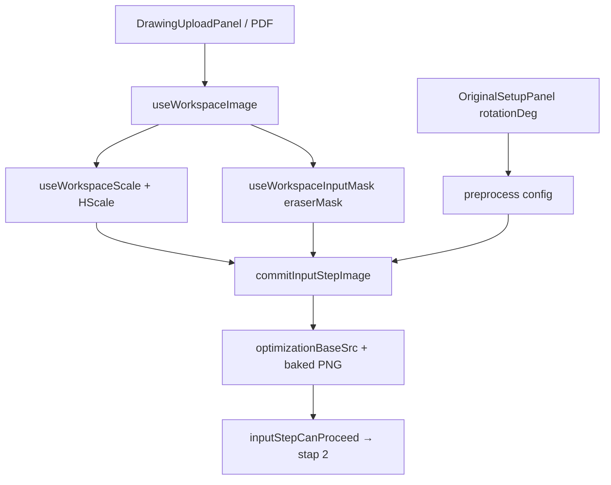

# Refactor rapport — stap 1 onderlegger — 2026-07-25

## Meta

| Veld | Waarde |
|------|--------|
| Module | Stap 1 `flowStep: input` — schaal, rotatie, gum/crop |
| Diepte | B |
| Doel | overdracht / minder slumber / lean bake-keten |
| Status | inventaris / batches open |
| Gerelateerde docs | [`../workspace-flow.md`](../workspace-flow.md), [`README.md`](./README.md) |

## Samenvatting

- Findings: weinig pure dead; kritieke bake-keten + compat-shims + dubbele mask-history.
- Richting: ~3 batches.
- Grootste risico: `commitInputStepImage` / schaal-transform fout → verkeerde px↔mm downstream.

## Architectuurkaart (huidig)

**Entry / stages / outputs**

- UI: `WorkspaceSidebarInputStep`, `DrawingUploadPanel`, `OriginalSetupPanel`, `InputMaskPanel`, `ScaleConfirmBar`
- Orkestratie: `useWorkspace` → `useWorkspacePreprocessWiring` → `useWorkspaceInputMask` + `useWorkspaceImage` + `useWorkspaceScale`
- Schaal: `useWorkspaceScale` ↔ `platform/calibration` (`useHScaleCalibration`); gate `inputStepCanProceed`
- Gum/crop: `useWorkspaceInputMask` → `cv/tools/eraser`, `maskImage.bakeMaskIntoCanvas`, `createMaskHistory` → `eraserMask` + `maskedWorkingCanvas`
- Rotatie: Konva-preview tot Volgende; bake in `commitInputStepImage` → `bakeUnderlayCanvas` + `normalizeWorkingCanvas` (`imageUtils.ts`)
- Floor: `OPTIMIZATION_BASE_DIMENSION = 3000` in `constants.ts`
- Output: `originalImageEl` + optioneel masked canvas; **geen** LBE-refs

## Findings

### D — Dead

| Item | Evidence | Batch | Risico |
|------|----------|-------|--------|
| Weinig pure dead in stap-1 panels | Panels klein; knip geen unused stap-1 files | — | — |
| `cv/tools/editCanvasHistory.ts` | knip: unused file (32 regels) — gerelateerd aan oude edit-canvas | 1 | Laag |

### W — Wet / duplicaat

| Locatie A | Locatie B | Owner-voorstel | Batch | Risico |
|-----------|-----------|----------------|-------|--------|
| Content-trim + upscale + schaal-transform | `imageUtils.ts` (~369) één bak | Split: scale-transform / content-normalize / load-upscale; re-export stabiel | 2 | Mid |
| `createMaskHistory` (MAX 40) | `createInkOverlayHistory` (MAX 30, stap 2) | Gedeelde undo-helper; limieten named const (waarden houden) | 3 | Laag–mid |

### H — Half-steen

| Item | Canonieke vervanger | Batch | Risico |
|------|---------------------|-------|--------|
| `editWorkingCanvas` stub in inkEdit → image wiring | Verwijderen als callers alleen null zetten | 1 | Laag |

### M — Magic number

| Waarde | Bestand | Betekenis (vermoed) | Const-voorstel | Batch |
|--------|---------|---------------------|----------------|-------|
| `eraserRadius = 10` | `useWorkspaceInputMask` | gum-radius px | `INPUT_ERASER_RADIUS_PX` | 3 |
| OCR padding `2` | inputMask | OCR-region pad | named (als OCR-mask hier blijft) | 3 |
| content-trim `250`/`50`/`12` | `imageUtils` | trim thresholds | cluster in normalize-module | 2 |
| rotatie epsilon `0.001` | `commitInputStepImage` | skip noop-rotatie | `ROTATION_EPS_DEG` | 2 |
| `OPTIMIZATION_BASE_DIMENSION = 3000` | `constants.ts` | min floor px | **F/P** — niet wijzigen zonder besluit | — |

### T — Test-gericht

| Item | Spec / productie | Actie | Batch |
|------|------------------|-------|-------|
| geen | — | — | — |

### G — God-file / structuur

| Bestand | Regels | Split-voorstel | Batch | Risico |
|---------|--------|----------------|-------|--------|
| `imageUtils.ts` | ~369 | scale / normalize / load | 2 | Mid |
| `useWorkspaceInputMask.ts` | ~323 | bij groei: mask-ops vs OCR-mask state | later | Laag |

### P — Policy / tuning ruis

| Item | Actie nu | Notitie |
|------|----------|---------|
| 3000px floor | F | Comment + decisions; 4k te zwaar |

### F — Bewust behouden

| Item | Reden |
|------|-------|
| Bake alleen bij Volgende | Contract workspace-flow; preview ≠ pixels |
| Geen refs op stap 1 | Contract |
| `ocrMask` state in inputMask | Gevuld in stap 3 OCR; compose-laag — niet verplaatsen naar geometry-pipeline |

## Voorgestelde batches

1. **Batch 1 — P0 stubs/knip** (laag) — strip `editWorkingCanvas` wiring indien grep schoon; overweeg `editCanvasHistory.ts` verwijderen — test: build + handmatige upload→schaal→gum→Volgende
2. **Batch 2 — P1 imageUtils split** (mid) — publieke exports via re-export houden — test: schaal + rotatie + crop roundtrip
3. **Batch 3 — P2 history/magic** (laag–mid) — gedeelde undo-API, named consts zelfde waarden

## Niet doen (deze ronde)

- Floor-dimensie wijzigen
- Live bake tijdens rotatie-preview
- Refs naar stap 1 verplaatsen

## Verificatie

- [x] knip (editCanvasHistory weg)
- [x] gerichte tests (working-image-utils)
- [ ] UI-smoke: upload → schaal → rotatie → gum/crop → Volgende → stap 2 B/W klopt
- [ ] full `npm run build` (repo heeft pre-existing tsc-ruis buiten ronde 1)

## Log

| Datum | Batch | Resultaat |
|-------|-------|-----------|
| 2026-07-25 | — | inventaris alleen |
| 2026-07-27 | 1 (P0 knip) | `editCanvasHistory` weg; `editWorkingCanvas` stub weg |
