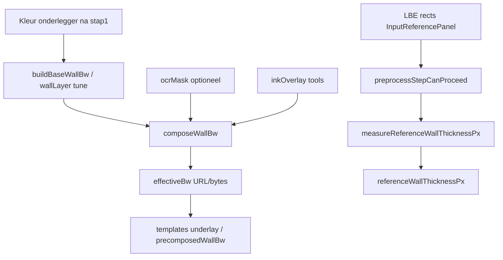

# Refactor rapport — stap 2 voorbewerking — 2026-07-25

## Meta

| Veld | Waarde |
|------|--------|
| Module | Stap 2 `flowStep: preprocess` — B/W, int muur, LBE-refs, OCR-toggle, muurdikte |
| Diepte | B |
| Doel | overdracht / legacy migratie-ruis weg / minder dubbele B/W-passes |
| Status | Batch 1–3 gedaan (2026-07-28 Batch 3: ocrLayer legacy + layer-preprocess split) |
| Gerelateerde docs | [`../workspace-flow.md`](../workspace-flow.md), [`README.md`](./README.md) |

## Samenvatting

- Findings: legacy preprocess-shape (ocrLayer, noiseReduction, init-tab `'ocr'`), dikte-meting herbouwt B/W, compose Pad B is recent en lean houden.
- Richting: ~3 batches.
- Grootste risico: meetpad wijzigen → andere `referenceWallThicknessPx` → hele detectie schaalt mee.

## Architectuurkaart (huidig)

**Entry / stages / outputs**

- UI: `WorkspaceSidebarPreprocessStep` → `PreprocessPanel` + `InputReferencePanel`
- Compose-owner: `cv/preprocess/compose-wall-bw.ts` (`composeWallBw`, `buildBaseWallBw`)
- State: `useWorkspaceWallBwCompose` → `effectiveBw*`
- Ink: `useWorkspaceInkEdit` (geen kleur-bake; `commitInkEdits` ≈ noop-status)
- Tune: `layer-preprocess` barrel → tabs/defaults/normalize (`resolveLayerPreprocess` / `normalizeStoredPreprocess` / `mirrorWallTuneToRoot`)
- Wiring: `useWorkspacePreprocessWiring` + `useWorkspacePreprocess` + preview-cache
- Refs: `useExampleSelection` + LBE alleen stap 2
- Dikte bij afronden: `measureReferenceWallThicknessPx` + `classifyWallRefStyleFromImage` op wallLayer-B/W
- OCR-toggle: `preprocess.ocrEnabled` (default uit)
- Tabs: `visiblePreprocessLayerTabs`; `GAPS_TAB_VISIBLE = false`

## Findings

### D — Dead

| Item | Evidence | Batch | Risico |
|------|----------|-------|--------|
| `visiblePreprocessLayerTabs(_ocrEnabled)` negeert arg | `constants.ts` — OCR geen stap-2-tab | 1 | Laag |
| Dubbele export `ensureWallBwReady` in wiring | `useWorkspacePreprocessWiring` L107 én L214 | 1 | Laag |

### W — Wet / duplicaat

| Locatie A | Locatie B | Owner-voorstel | Batch | Risico |
|-----------|-----------|----------------|-------|--------|
| `measureReferenceWallThicknessPx` → ~~`runPreprocessLayer` opnieuw~~ | `wallBw.baseBw` ná bake | Meet op canonieke baseBw (wall + gebakken ink; geen OCR) | ~~2~~ **gedaan** | Mid |
| `wallTuneFingerprint` | `fingerprintLayers` in preprocess | Eén fingerprint-helper | ~~3~~ **gedaan** | Laag |

### H — Half-steen

| Item | Canonieke vervanger | Batch | Risico |
|------|---------------------|-------|--------|
| `ocrLayer` storage + `ensureLayerRecords` | Runtime deelt `wallLayer`; storage begrensen of documenteren | ~~3~~ **gedaan** (legacy docs + fingerprint op wall) | Mid |
| `commitInkEdits` naam = bake-suggestie | Hernoemen naar sync/touched of JSDoc | 1 | Laag |
| Gaten-tab UI uit, codepaden blijven | Sticky force-away in flow; gapsInkMode localStorage | 3 / F | Mid |
| `preprocessTab` init `'ocr'` → redirect `'walls'` | Default `'walls'` | ~~1~~ **gedaan** | Laag |
| Legacy `noiseReduction` → smooth/bridge | `applyLegacyNoiseFlags` + `@deprecated` types | 3 | Laag |

### M — Magic number

| Waarde | Bestand | Betekenis | Const-voorstel | Batch |
|--------|---------|-----------|----------------|-------|
| debounce `220` ms | `useWorkspacePreprocess` | live preview | `PREPROCESS_PREVIEW_DEBOUNCE_MS` | 3 |
| brush `4` px, undo 30 | inkEdit / compose | ink tools | named naast compose | 3 |
| `WALL_LAYER_DEFAULTS` (150/11/1/32…) | `layer-preprocess` | OpenCV tune | **F/P** — alleen namen, geen waarden | — |

### T — Test-gericht

| Item | Spec / productie | Actie | Batch |
|------|------------------|-------|-------|
| geen specifiek | — | — | — |

### G — God-file / structuur

| Bestand | Regels | Split-voorstel | Batch | Risico |
|---------|--------|----------------|-------|--------|
| `layer-preprocess.ts` | 421 | tabs/labels vs resolve/normalize vs defaults | ~~3~~ **gedaan** (barrel + 3 files) | Mid |
| `PreprocessPanel.vue` | ~398 | presentatie vs ensureLayerRecords | later | Laag |
| `compose-wall-bw.ts` | 268–287 | lean — niet splitsen | F | — |

### P — Policy / tuning ruis

| Item | Actie nu | Notitie |
|------|----------|---------|
| Gaps/OCR layer-defaults | F | niet tunen |
| Compose order base→OCR→ink | F | Pad B besluit 2026-07-25 |

### F — Bewust behouden

| Item | Reden |
|------|-------|
| Compose Pad B (geen bake ink→kleur) | FML-underlay blijft kleur; ink→baseBw bij afronden stap 2 |
| `resolveLayerPreprocess` enige flat OpenCV-config | DRY |
| Gate ≥1 muurvak + dikte hard bij afronden | Contract |
| Ref-crops = wallLayer (geen lokale Otsu) | Contract |
| `mirrorWallTuneToRoot` | Export/legacy flat fields nog gebruikt |

## Voorgestelde batches

1. ~~**Batch 1 — P0 migratie-ruis** (laag) — `preprocessTab='walls'`; drop unused `_ocrEnabled`; hernoem/doc `commitInkEdits`; dedupe wiring export~~ **deels ronde 1 + rest ronde 3**
2. ~~**Batch 2 — P1 meetpad DRY** (mid) — dikte vanaf bestaande `baseBw` **ná bake**~~ **gedaan ronde 3**
3. ~~**Batch 3 — P2 legacy shape** (mid) — documenteer/begrens `ocrLayer`; split `layer-preprocess`; fingerprint DRY — storage-shape voorlopig houden~~ **gedaan 2026-07-28**

## Niet doen

- Compose-order of bake-naar-kleur terugdraaien
- Gaps-tab weer aanzetten zonder productbesluit
- Wall-default thresholds wijzigen

## Verificatie

- [x] build
- [ ] UI-smoke Project4: B/W tune, penseel/gum, OCR toggle, refs, afronden dikte, download effectiveBw
- [x] knip indien exports

## Log

| Datum | Batch | Resultaat |
|-------|-------|-----------|
| 2026-07-25 | — | inventaris alleen |
| 2026-07-27 | 1 (deel) | `_ocrEnabled` param weg; `ensureWallBwReady` dedupe; schema `doorLayer`/`windowLayer`/`ocrMaskTextForGeometry`/`lineDetectorMode` weg |
| 2026-07-27 | 3 (meetpad) | `preprocessTab` default `'walls'`; meetpad DRY op `baseBw` ná bake (geen kleur-rebuild); `getBaseWallBw` wiring |
| 2026-07-28 | 3 (legacy) | `ocrLayer` JSDoc/legacy; `layerTuneFingerprintParts` DRY; OCR-invalidatie op wall; split tabs/defaults/normalize + lean barrel |
