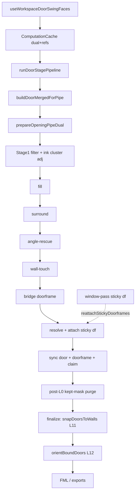

# Refactor rapport — stap 3 door detectie — 2026-07-25

## Meta

| Veld | Waarde |
|------|--------|
| Module | `frontend/src/cv/doors/**` + UI `useWorkspaceDoorSwing*` |
| Diepte | B (UI faces-split = C-rand) |
| Doel | overdracht / god-files / half-stenen / magic→const |
| Status | ronde 4 + ronde 7 L11 + ronde 8 UI faces gedaan 2026-07-27 |
| Gerelateerde docs | [`../door-detection-flow.md`](../door-detection-flow.md), [`../cv-primitive-centralization-audit.md`](../cv-primitive-centralization-audit.md), [`consumer-chain/02-doors-stages.md`](./consumer-chain/02-doors-stages.md) |

## Samenvatting

- Volume: `cv/doors` incl. L11-split modules (entry ~243 na ronde 7).
- Alias-files `door-adjacency` / `door-enclosed-detach` / `openingWhiteFromDual` = **al weg** (skill-pilottekst verouderd).
- Open audit **#6**: ink-adjacency rebuild na white-detach — **F** (deur-only; gedocumenteerd).
- Hotspots (≈2026-07-27 post-ronde 7): L11 gesplit (entry **~243** + modules); Stage-1 lean; UI faces (**~885**) nog open.
- Post-inventaris (gedrag, geen refactor-batch): wall-touch, kept-mask purge, sticky df, Path A/B dual, L12 morph-close + framing, `existingDoorsOnly`+angle-rescue, `arcCentroidPx` weg.

## Architectuurkaart (huidig)

**Entry / stages / outputs**

- Runner: `run-door-stage-pipeline.ts` — `runDoorStagePipeline`, `buildDoorMergedForPipe`
- Stages: filter → fill → surround → angle-rescue → wall-touch → bridge → resolve/attach
- `existingDoorsOnly`: skip fill/surround/bridge/wall-touch; angle-rescue alleen class=`door`
- Attach: `door-attach-doorframes.ts` (sticky frames; peel + reattach na window)
- L11: `snapDoorsToWalls` — Path A doorframe-first segment; Path B ink-adjacent `wall` segment-first
- L12: `orientBoundDoors` + `door-l12-hinge` (multi-face: directional MORPH_CLOSE; geen angle-prior)
- Policy: `DOOR_SPACE_POLICY` (apart van windows)
- Shared rooms: `prepareOpeningPipeDual`, `buildLabelAdjacency`, `assertSpacePolicy`, claim/sync wrappers
- UI: refresh-pass → push → finalize snap; demote live-prune stage-cache; geen `tabOutputs` voor deuren

## Findings

### D — Dead

| Item | Evidence | Batch | Risico |
|------|----------|-------|--------|
| `renderDoorSwingOverlay` | knip unused export (wrappers wél gebruikt) | 1 | Laag |
| `DOOR_WALL_SNAP_TUNING` export | knip unused; intern via `T` | 1 | Laag |
| `signatureForParentMap` | knip unused in helpers | 1 | Laag |
| ~~`arcCentroidPx`~~ | verwijderd | — | — |
| Oude alias-files | al verwijderd | — | — |

### W — Wet / duplicaat

| Locatie A | Locatie B | Owner-voorstel | Batch | Risico |
|-----------|-----------|----------------|-------|--------|
| Cluster ink-adj herbouw in runner | raam gebruikt `pipeDual.ink.adjacency` | Audit #6: deur-only **F** | F | — |
| Dual resolve in cache/exports/probe | `resolveFloorDual` owner | Callers al op owner; geen parallel builder | F | — |

### H — Half-steen

| Item | Canonieke vervanger | Batch | Risico |
|------|---------------------|-------|--------|
| ~~`skipDetach?: boolean` fallback in filter~~ | detach-owner = `prepareOpeningPipeDual` | 1 done | — |
| Surround white/rays | al weg; alleen comment | F | — |
| `legacyOverhangPx` naming in resolve | rename later zonder gedrag | later | Laag |

### M — Magic number

| Waarde | Bestand | Betekenis | Const-voorstel | Batch |
|--------|---------|-----------|----------------|-------|
| diepte ±15%, fill &lt;0.80, hoek ±10° | angle-rescue | al `DOOR_ANGLE_RESCUE_TUNING` | F | — |
| clipped-arc score 0.55/0.3/0.15 + floor | matching | `DOOR_SWING_TUNING.clippedArcScore*` | 2 done | — |
| L11 thresholds | `DOOR_WALL_SNAP_TUNING` | al geclusterd | F (goed patroon) | — |
| L12 morph-close kernel | `door-l12-hinge` | multi-face ink-bruggen | al via helper; geen waardewijziging | F |

### T — Test-gericht

| Item | Spec / productie | Actie | Batch |
|------|------------------|-------|-------|
| dual/parent-detach specs | productie-API | OK | — |
| geen fixture-label-branches gezien | — | — | — |

### G — God-file / structuur

| Bestand | Regels (≈07-27) | Split-voorstel | Batch | Risico |
|---------|-----------------|----------------|-------|--------|
| ~~`door-wall-snap.ts`~~ | lean entry **~243** + tuning/geom/scoring/bind/doorframe/path-b | done ronde 7 | — | — |
| ~~`door-swing-filter.ts`~~ | lean + cluster/seed | done ronde 4 | — | — |
| `useWorkspaceDoorSwingFaces.ts` | **~885** | refresh vs finalize vs sticky vs demote-prune | UI/C (= ronde 8) | Mid–hoog |
| matching / angle-rescue | 346 / 317 | OK onder 400 | — | — |

### P — Policy / tuning ruis

| Item | Actie nu | Notitie |
|------|----------|---------|
| Either wall-rescue / angle-rescue / sticky doorframe | F | recent besluiten; niet “opschonen” |
| Wall-touch / kept-mask purge | F | G voor juiste L12 |
| `DOOR_SPACE_POLICY` vs window | F | niet mergen |

### F — Bewust behouden

| Item | Reden |
|------|-------|
| Wall-rescue alleen deur (`buildDoorMergedForPipe`) | domain |
| L11 Path A segment-first + sticky pins | memory 2026-07-25 |
| L11 Path B ink-adjacent wall (geen white+wallMask) | memory 2026-07-25 |
| Bridge → `doorframe` class | surround ink-adjacency only |
| L12 clear vs FML framing; morph-close hinge | memory 2026-07-25/27 |
| `existingDoorsOnly` + angle-rescue class=`door` | demote/restore twins |
| Archive openings museum | parking lot leeg — niet hergebruiken |
| Policies apart | centralization-audit |

## Voorgestelde batches

1. ~~**Batch 1 — P0 knip + skipDetach**~~ **gedaan** (knip ronde 1; skipDetach ronde 4)
2. ~~**Batch 2 — P1 Stage-1 split + magic→const**~~ **gedaan** ronde 4 — #6 F in flow-doc
3. ~~**Batch 3 L11**~~ **gedaan** ronde 7 — `door-wall-snap` gesplit; entry `snapDoorsToWalls` stabiel
4. ~~**Batch 3 UI**~~ **gedaan** ronde 8 — `door-faces-snap` (sticky + L11/L12 UI-orch); helpers/cache bleven

## Niet doen

- Policies deur↔raam mergen
- L11 tuning / Path A semantiek wijzigen
- Archive openings terugtrekken
- Stage-2 her-run voor sticky frames
- Morph-close / wall-touch / purge “opschonen” zonder besluit

## Verificatie

- [ ] build
- [ ] `npx vitest run tests/cv/doors`
- [ ] UI-smoke: Project4 twin + single doorframeFaceIds na afronden; angle-rescue 360/361; demote restore twin overlay

## Log

| Datum | Batch | Resultaat |
|-------|-------|-----------|
| 2026-07-25 | — | inventaris alleen |
| 2026-07-27 | — | docs-sync: pipeline-volgorde, line counts, post-inventaris F |
| 2026-07-27 | 1 (knip) | `renderDoorSwingOverlay` intern; `DOOR_WALL_SNAP_TUNING` unexported; `signatureForParentMap` weg |
| 2026-07-27 | 1+2 (ronde 4) | `skipDetach` weg; Stage-1 → `filter-cluster`/`filter-seed`/lean entry; clipped-arc weights → `DOOR_SWING_TUNING`; #6 F |
| 2026-07-27 | 3 L11 (ronde 7) | `door-wall-snap` → tuning/geom/scoring/bind/doorframe/path-b + lean entry (~243); 25 L11 specs groen; UI faces open |
| 2026-07-27 | 3 UI (ronde 8) | `door-faces-snap`; DoorSwingFaces ~747; demote-spec + prune specs groen; Project4 smoke functioneel OK |
