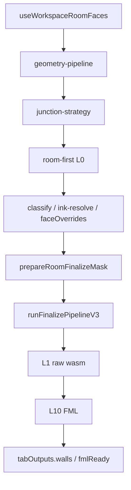

# Refactor rapport — stap 3 wall detectie — 2026-07-25

## Meta

| Veld | Waarde |
|------|--------|
| Module | Stap 3 muren — room-first L0 + V3 L1–L10 + face-class |
| Diepte | B (L6 Cat C = NO-GO zonder besluit) |
| Doel | overdracht / archive uit actief pad / L0 leaner |
| Status | inventaris; **Batch 1 + Batch 2 (L0 split) gedaan** (ronde 16, 2026-07-28) |
| Gerelateerde docs | [`../workspace-flow.md`](../workspace-flow.md), [`../archive/wall-face-class-flow.md`](../archive/wall-face-class-flow.md), [`../cv-primitive-centralization-audit.md`](../cv-primitive-centralization-audit.md), V3 layer-decisions |

## Samenvatting

- Volume: `cv/walls/**` ~107 files / ~18.8k regels (waarvan pipeline-v3 ~10.5k).
- ~~Archive-V2 geïmporteerd in `room-first`~~ → **gedaan**: `strategies/room-first.ts` alleen `runFinalizePipelineV3` (~470 regels).
- ~~L0 `room-ink-classify` god-file~~ → **ronde 16**: lean barrel + mapping/effective/autoclass/render.
- L6 connector-cluster bewust dik (F); `room-raster-cache` nog open.
- Post-inventaris (niet refactor): face bbox-index op cache; classify toggle zonder dual-rebuild; finalize mask mapping ongewijzigd.

## Architectuurkaart (huidig)

**Entry / stages / outputs**

- UI: `useWorkspaceRoomFaces` (`finalizeWallDetection`); `useWorkspaceWallPipeline` forceert `'v3'`
- Bridge: `geometry-pipeline.ts` → `junction-strategy` → `room-first`
- L0: classify CC → ink-resolve → enclosed → faceOverrides → finalize mask
- V3: `rooms/pipeline-v3/` → `runPipelineV3` / `runFinalizePipelineV3` L1…L10
- Face-class alleen L0; V3 ziet binary mask + blobs (+ dikte) — geen `RoomRasterClass`
- Face bbox-index: persistente white/ink components op cache; dual classEpoch (geen `ensureFaceDualSpace` op toggle/box)
- DRY-owners: `face-dual-space`, `face-override-sync`, `opening-*`, `label-adjacency`, `wall-ink-bridge`, `room-ink-classify` mask mapping
- Output: `tabOutputs.walls` + `pipelineV3Debug` + `roomWallMaskRle`; semantic graph post-hoc (stap 4)

## Findings

### D — Dead

| Item | Evidence | Batch | Risico |
|------|----------|-------|--------|
| `room-recalculate-faces.ts` | 2-regel `@deprecated` re-export → `room-ink-process` | 1 (rest) | Laag |
| knip unused exports | o.a. `rebuildFaceBBoxWhite`, `renderRoomRasterPreviewMaskWithUrlUnderlay`, diverse L6 `resolveLayer6*` | 1 / F | Laag–mid |
| ~~V2 finalize-branch~~ | verwijderd; alleen V3 | **gedaan** | — |

### W — Wet / duplicaat

| Locatie A | Locatie B | Owner-voorstel | Batch | Risico |
|-----------|-----------|----------------|-------|--------|
| Dual/claim/adjacency | grotendeels gecentraliseerd | Geen her-centralisatie | F | — |
| `build-semantic-walls-source` | actief via output + UI | ~~Rename later~~ **stap4 Batch 3** | F | — |

### H — Half-steen

| Item | Canonieke vervanger | Batch | Risico |
|------|---------------------|-------|--------|
| ~~**Archive-import in actief pad**~~ | `room-first` V3-only | **gedaan** | — |
| Ink-resolve unused `@deprecated` opts | weg of internal | 1 | Laag |
| Abs-px constants Prefer `resolve*Px(ref)` | migrate callers | later | Mid |

### M — Magic number

| Waarde | Bestand | Betekenis | Const-voorstel | Batch |
|--------|---------|-----------|----------------|-------|
| Abs-px defaults | `wall-segment-geometry-constants.ts` e.d. | schaalbanden | prefer resolve*(ref); geen waardewijziging | later |
| L6 connector constants | `pipeline-v3/engines/connector/constants.ts` | chamfer/junction | **F/P** | — |

### T — Test-gericht

| Item | Spec / productie | Actie | Batch |
|------|------------------|-------|-------|
| `resolveMaxChildBboxPx` deprecated “voor tests” | documenteer F of internaliseer | 1 | Laag |
| L2/L5/L6 probe specs | F | — | — |

### G — God-file / structuur

| Bestand | Regels (≈07-28) | Split-voorstel | Batch | Risico |
|---------|-----------------|----------------|-------|--------|
| ~~`room-ink-classify.ts`~~ | lean barrel **~42** + mapping/effective/autoclass/render | ~~split~~ **ronde 16** | 2 | — |
| `room-raster-cache.ts` | ~711 | pin/dual surface inkorten | later | Mid |
| `strategies/room-first.ts` | **470** | classify vs finalize al leaner na V3-only | 1–2 | Mid |
| `chamfer-chain.ts` | 632 | L6 cluster | NO-GO | Hoog |
| `chamfer-group-geometry.ts` | 622 | L6 | NO-GO | Hoog |
| `connector-detect.ts` | 493 | L6 | NO-GO | Hoog |
| `junction-repair.ts` | 491 | L6 | NO-GO | Hoog |
| `room-wall-segment-thickness.ts` | 538 | thickness helpers | later | Mid |
| `useWorkspaceRoomFaces.ts` | **733** | UI — demote hooks + bbox-index; zie ui-ux | UI | Mid |

### P — Policy / tuning ruis

| Item | Actie nu | Notitie |
|------|----------|---------|
| Cat C L5 over-fit | F | alleen met besluit |
| L6 chamfer-machinerie ~3.5k | F | memory: bewust dik |

### F — Bewust behouden

| Item | Reden |
|------|-------|
| V3 L1–L10 engines apart | layer-contracts |
| Face-class niet in pipeline-v3 | wall-face-class-flow |
| OCR niet in geometry-pipeline | workspace-flow |
| `baseline.ts` niet tunen | harde regel |
| Dual/claim/pin owners in rooms | centralization-audit done |
| Face bbox-index (geen dual op toggle) | perf; memory 2026-07-25 |
| `src/archive/**` parking lot | geen actieve imports |
| `refineWallClassificationByKeptMask` | half-stone: niet in finalize; wel specs (F) |
| Importpad `room-ink-classify` barrel | callers niet naar submodules |

## Voorgestelde batches

1. ~~**Batch 1 — P0 archive-V2 + dode aliases**~~ **gedaan**
2. ~~**Batch 2 — P1 L0 split**~~ **gedaan** ronde 16 — `room-ink-classify-{mapping,effective,autoclass,render}` + lean barrel; `ROOM_INK_CLASSIFY_TUNING`; `isFaceConnectedToExterior` private; cache **niet** gesplit
3. **Batch 3 — P2 L6** — **NO-GO** zonder Cat C / productbesluit
4. **Later** — `room-raster-cache` surface (apart go)

## Niet doen

- Detectie-tuning / abs-px waarden wijzigen
- Archive V2 “terug” in museum-pad
- Face-class in V3 trekken

## Verificatie

- [x] archive-V2 uit `room-first` (2026-07-25)
- [x] vite build (ronde 16)
- [x] gerichte classify/cache/process specs 77/77 (ronde 16)
- [ ] UI-smoke: stap 3 classify → face-klik → afronden → L10 in layer-debug (Project4)

## Log

| Datum | Batch | Resultaat |
|-------|-------|-----------|
| 2026-07-25 | — | inventaris alleen |
| 2026-07-25 | 1 (deel) | archive leeg + room-first V3-only |
| 2026-07-27 | — | docs-sync: mermaid, line counts, bbox-index F |
| 2026-07-27 | 1 (rest) | `room-recalculate-faces` weg; `rebuildFaceBBoxWhite` / URL-underlay export weg; ink-resolve deprecated opts weg |
| 2026-07-28 | 2 (L0) | classify → mapping/effective/autoclass/render + barrel ~42; DRY pickers + TUNING; 77 specs; cache later |
