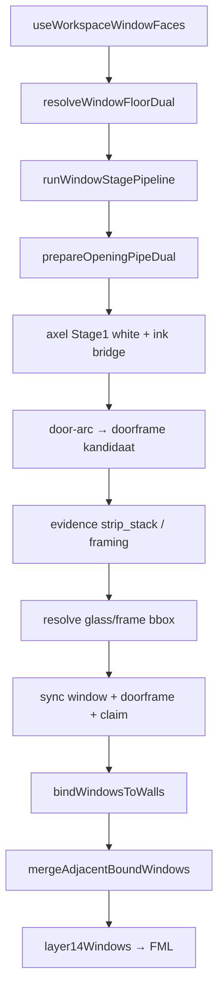

# Refactor rapport — stap 3 window detectie — 2026-07-25

## Meta

| Veld | Waarde |
|------|--------|
| Module | `frontend/src/cv/windows/**` + UI `useWorkspaceWindowFaces` |
| Diepte | B (UI faces-split = C-rand) |
| Doel | overdracht / Stage-3 god-file / magic→const |
| Status | ronde 5 + UI faces (8) gedaan 2026-07-27 |
| Gerelateerde docs | [`../window-detection-flow.md`](../window-detection-flow.md), [`../cv-primitive-centralization-audit.md`](../cv-primitive-centralization-audit.md), [`consumer-chain/03-windows-stages.md`](./consumer-chain/03-windows-stages.md) |

## Samenvatting

- Volume: ~22 files — leaner dan doors/walls.
- Hotspots (≈2026-07-27 post-ronde 5): UI `useWorkspaceWindowFaces` (**898**); Stage-3 entry lean + geom/stack/framing.
- Dual/bootstrap clean via `prepareOpeningPipeDual`; geen wall-rescue (bewust ≠ deur).
- Seam: doorframe ownership gedeeld met deur sticky/L11 — geen shared policy forceren.
- Post-inventaris: demote live-prune; Stage-3 doorframe retarget alleen `faceIds` + as-overlap.

## Architectuurkaart (huidig)

**Entry / stages / outputs**

- Runner: `run-window-stage-pipeline.ts`; glue `build-window-pipeline-from-workspace.ts` (`runWindowStagePipelineWithBands`, thin alias `resolveWindowFloorDual`)
- Stages: axel → door-arc → evidence → resolve
- L14: `bindWindowsToWalls` + `mergeAdjacentBoundWindows`
- Policy: `WINDOW_SPACE_POLICY`
- Cluster via gedeelde `wall-ink-bridge`; geom-gates lokaal in `window-axel-cluster`
- Geen `tabOutputs` voor ramen; faces → class `window`; finalize window→wall in mask

## Findings

### D — Dead

| Item | Evidence | Batch | Risico |
|------|----------|-------|--------|
| Weinig knip-orphans in windows-map | modules klein/actief | 1 audit | Laag |
| Barrel `export *` breed | triage bij knip-pass | 1 | Laag |

### W — Wet / duplicaat

| Locatie A | Locatie B | Owner-voorstel | Batch | Risico |
|-----------|-----------|----------------|-------|--------|
| Ink-bridge hop | doors gebruiken zelfde owner | OK — domain greedy/geom blijft apart | F | — |
| UI faces orchestratie | deur faces spiegelpatroon | Later gedeelde “opening faces shell” alleen bij diepte C | later | Hoog |

### H — Half-steen

| Item | Canonieke vervanger | Batch | Risico |
|------|---------------------|-------|--------|
| `resolveWindowFloorDual` thin alias | unalias callers → `resolveFloorDual` of behouden | 1 / F | Laag |
| Geen parallelle dual-build | — | — | — |

### M — Magic number

| Waarde | Bestand | Betekenis | Const-voorstel | Batch |
|--------|---------|-----------|----------------|-------|
| `MIN_WINDOW_GLASS_CM = 20` | runner | min glas | al named — check clustering | 1 |
| ~~ratios in evidence-filter~~ | `WINDOW_EVIDENCE_TUNING` | strip_stack / framing | done ronde 5 | — |
| merge ≤20% afwijking | flow-doc / merge | L14 merge | named indien literal | 1 |

### T — Test-gericht

| Item | Spec / productie | Actie | Batch |
|------|------------------|-------|-------|
| `tests/cv/windows/**` | stages gedekt | OK | — |

### G — God-file / structuur

| Bestand | Regels (≈07-27) | Split-voorstel | Batch | Risico |
|---------|------------------|----------------|-------|--------|
| `useWorkspaceWindowFaces.ts` | **898** | pipeline vs overlay vs L14 vs demote-prune | UI/C | Mid–hoog |
| ~~`window-evidence-filter.ts`~~ | lean (~182) + geom/stack/framing | done ronde 5 | — | — |
| Rest windows | &lt;400 | — | — | — |

### P — Policy / tuning ruis

| Item | Actie nu | Notitie |
|------|----------|---------|
| Stage3 framing `either`; REF rails white/ink | F | Project4 asymmetrische rails |
| Class-gate breder dan `isOpeningWhiteClass` | F | documenteer in flow-doc |

### F — Bewust behouden

| Item | Reden |
|------|-------|
| Geen `mergeOpeningWhiteWithWallInk` voor ramen | ≠ deur wall-rescue |
| `WINDOW_SPACE_POLICY` apart | niet mergen |
| Doorframe via Stage2–4, niet L14 | contract |
| Archive openings museum | parking lot leeg — geen actieve imports |
| Template-ID UI per-ref | feature, geen refactor |
| Demote live-prune stage-cache/overlay/`boundWindows` | memory 2026-07-26; zelfde patroon als deur |
| Stage-3 doorframe retarget = faceIds + as-overlap | geen evidenceFaceIds (BouwTek11 vals+) |

## Voorgestelde batches

1. ~~**Batch 1 — P0 magic→named**~~ **gedaan ronde 5** — `WINDOW_EVIDENCE_TUNING`
2. ~~**Batch 2 — P1 evidence-filter split**~~ **gedaan ronde 5** — geom / stack / framing + lean entry
3. ~~**Batch 3 — P2 UI faces split**~~ **gedaan** ronde 8 — `window-faces-helpers` + `window-faces-bind` (L14); prune ongemoeid

## Niet doen

- Deur↔raam policy merge
- Wall-rescue voor ramen toevoegen “voor DRY”
- Template-ID feature in refactor-batch

## Verificatie

- [x] `npx vitest run tests/cv/windows` — 71/71 (2026-07-27)
- [x] `npx vitest run tests/ui/window-stage-cache-prune.spec.ts` — groen (ronde 8)
- [ ] UI-smoke: Project4 Stage 3; De Roemer Hal/mk 4→merge; cyaan faces op Muren-tab
- Nota: volledige `vue-tsc -b` heeft pre-existing errors buiten scope; geen `window-evidence-*` / faces-src-fouten

## Log

| Datum | Batch | Resultaat |
|-------|-------|-----------|
| 2026-07-25 | — | inventaris alleen |
| 2026-07-27 | — | docs-sync: line counts, demote/retarget F |
| 2026-07-27 | 1+2 (ronde 5) | `WINDOW_EVIDENCE_TUNING`; split filter≈182 / geom≈136 / framing≈185 / stack≈267; entry + `growFullStackFromSeedFaces` stabiel; vitest 71/71 |
| 2026-07-27 | 3 (ronde 8) | `window-faces-helpers`+`bind`; WindowFaces ~686; prune ongemoeid; Project4 smoke functioneel OK |
