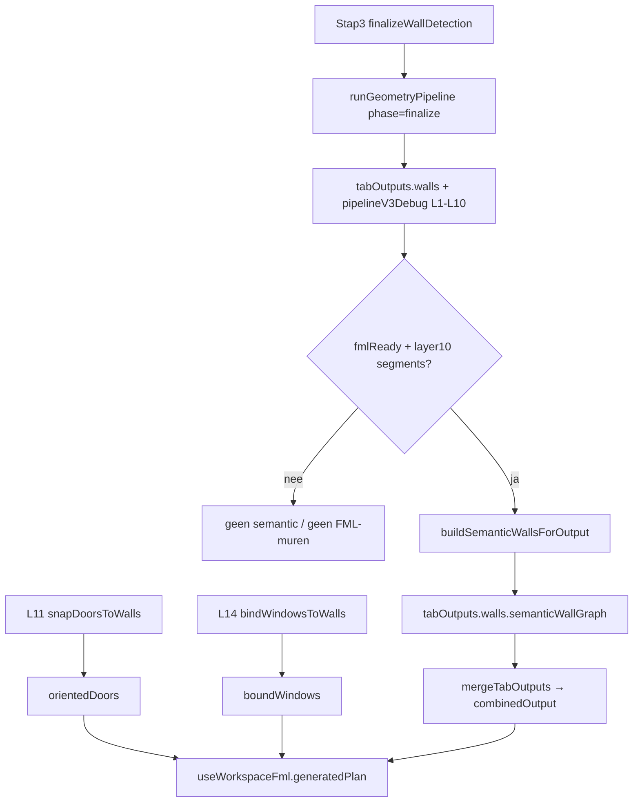

# Refactor rapport — stap 4 conversie — 2026-07-25

## Meta

| Veld | Waarde |
|------|--------|
| Module | merge/tabOutputs → vector/geometry conversie (vóór FML-build) |
| Diepte | B |
| Doel | overdracht / eerlijke seams / minder dubbele snap |
| Status | Batch 1–3 done (Batch 3: 2026-07-28) |
| Gerelateerde docs | [`../workspace-flow.md`](../workspace-flow.md) (stap 4), [`README.md`](./README.md) |

**Note:** Conversie-seam: [`../fml-layer8-conversion-plan.md`](../fml-layer8-conversion-plan.md) (V3 L10 + compose↔semantic). Export-options leeft in archive.

## Samenvatting

- Pipeline-map zelf klein; conversie-gewicht zit in UI + semantic-source + openings-refs.
- Kernprobleem: `composeLayers` levert geen muren meer; FML hangt aan post-finalize `buildSemanticWallsForOutput` (L10/`fmlReady`).
- Openings (L11/L12/L14) zitten **niet** in `combinedOutput` — parallelle refs; deur-swing export hergebruikt live L12.

## Architectuurkaart (huidig)

**Entry / stages / outputs**

- Types/merge: `cv/pipeline/merge-tab-outputs.ts` — `emptyTabOutputs`, `mergeTabOutputs`, `tabFromDetectTargets`
- Validatie: `cv/workspace/layer-flow.ts` — `detectTargetsForTab`, `isValidTabOutput`, `isFinalizeTabOutput`; detection order = `['walls']`
- CV-run: `geometry-pipeline.ts` → `composeLayers` (zonder wall/wallGraph → lege segments)
- Semantic: `build-semantic-walls-source.ts` + `build-semantic-walls-output.ts` — `resolveFmlSourceLayer`, `hasFmlSemanticSource`, `buildSemanticWallsForOutput`
- UI: `useWorkspaceSemanticWalls`, `useWorkspaceRoomPipeline`, `useWorkspaceDetection` schrijft `tabOutputs`
- Na finalize: `buildAfterFinalize` schrijft semantic graph terug in `tabOutputs.walls`
- Openings: `orientedDoors` / `boundWindows` refs — buiten tabOutputs

## Findings

### D — Dead

| Item | Evidence | Batch | Risico |
|------|----------|-------|--------|
| Private aliases `isV2Layer8SemanticSource`, `buildSemanticGraphFromLayer8` | ~~`build-semantic-walls-v2`~~ → source — weg | ~~1~~ **gedaan** | Laag |
| `composeLayers({ wall, wallGraph })` params deels dood | geometry-pipeline roept zonder wall | 1–2 | Laag |

### W — Wet / duplicaat

| Locatie A | Locatie B | Owner-voorstel | Batch | Risico |
|-----------|-----------|----------------|-------|--------|
| Junction-graph build | semantic-source + merge + extractionToPlan | Eén helper / eps const | ~~2~~ **gedaan** | Mid |
| `snapDoorsToWalls` in deur-swing export | opnieuw naast door-faces | Hergebruik live `orientedDoors` | ~~3~~ **gedaan** | Mid |

### H — Half-steen

| Item | Canonieke vervanger | Batch | Risico |
|------|---------------------|-------|--------|
| Naming `isV2FmlSemanticSource` / file `-v2` dekt V3 L10 | `hasFmlSemanticSource` + `build-semantic-walls-source` | ~~3~~ **gedaan** | Mid |
| Ontbrekende `fml-layer8-conversion-plan.md` | korte conversion-note in `.cursor/docs/` of link fix | 1 | Laag |
| Compose levert lege segments; semantic post-hoc | documenteer of `ensureSemanticWalls` helper | 2 | Mid |

### M — Magic number

| Waarde | Bestand | Betekenis | Const-voorstel | Batch |
|--------|---------|-----------|----------------|-------|
| junction eps `8` | merge / semantic | graph merge | `JUNCTION_EPS_PX` gedeeld | 2 |
| confidence `0.9` | merge/semantic | segment confidence | named | 2 |

### T — Test-gericht

| Item | Spec / productie | Actie | Batch |
|------|------------------|-------|-------|
| Geen dedicated merge-tab-outputs tests | alleen `layer-flow.spec.ts` | overweeg smoke-test merge | 2 | Laag |

### G — God-file / structuur

| Bestand | Regels | Split-voorstel | Batch | Risico |
|---------|--------|----------------|-------|--------|
| Pipeline-map totaal | ~330 | klein — OK | F | — |
| Conversie verspreid over UI | room-pipeline + semantic + exports | `ensureSemanticWalls` helper | 2 | Mid |
| Seams L11/L14 god-files | zie doors/windows | niet hier splitsen | — | — |

### P — Policy / tuning ruis

| Item | Actie nu | Notitie |
|------|----------|---------|
| geen detectie-tuning in conversie | — | — |

### F — Bewust behouden

| Item | Reden |
|------|-------|
| `fmlReady`-gate: nooit L8/L9 fallback | incomplete V3 mag geen FML-muren |
| Openings niet via geometry-pipeline | compose-layers comment + archive |
| `tabOutputs` primair in detectie-run | semantic write-back = conversie, geen her-detectie |
| `isValidTabOutput`: `geometry-lbe` + `elapsedMs > 0.5` | contract |

## Voorgestelde batches

1. ~~**Batch 1 — P0 docs/aliases/seam**~~ **gedaan** — private aliases weg; conversion-note; compose↔semantic gedocumenteerd
2. ~~**Batch 2 — P1 conversie-helper**~~ **gedaan** — `ensureSemanticWallsOnTabOutputs`; compose-call eerlijk; `SEMANTIC_JUNCTION_EPS_PX` + `SEMANTIC_SEGMENT_CONFIDENCE` DRY
3. ~~**Batch 3 — P2 exports hergebruik orientedDoors + rename v2**~~ **gedaan 2026-07-28** — live L12 in deur-swing export; `build-semantic-walls-source` + `hasFmlSemanticSource`

## Niet doen

- Openings terug in geometry-pipeline
- FML uit L8/L9 bij incomplete V3
- `tabOutputs` vullen buiten detectie/conversie-contract
- Debug-payload uit merge strippen (overlay O — F)

## Verificatie

- [x] build (gerichte modules; repo-breed tsc-schuld pre-existing)
- [x] `npx vitest run tests/cv/layer-flow.spec.ts tests/cv/walls/build-semantic-walls-output.spec.ts`
- [ ] UI-smoke: finalize → vector-tab muren zichtbaar; zonder fmlReady geen valse muren

## Log

| Datum | Batch | Resultaat |
|-------|-------|-----------|
| 2026-07-25 | — | inventaris alleen |
| 2026-07-27 | 1 (P0) | private Layer8-aliases weg; `debugRoomWallFaces*` passthrough weg |
| 2026-07-27 | 1 rest + 2 | conversion-note; `ensureSemanticWallsOnTabOutputs`; semantic consts DRY; UI write-back dun |
| 2026-07-28 | 3 | deur-swing export prefer live `orientedDoors`; rename `build-semantic-walls-source` / `hasFmlSemanticSource`; vite OK; semantic+FML-gate specs groen |
