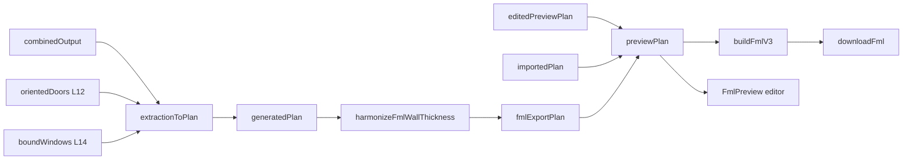

# Refactor rapport — stap 4 FML — 2026-07-25

## Meta

| Veld | Waarde |
|------|--------|
| Module | `frontend/src/core/fml/**` + `useWorkspaceFml` + FML-preview editor |
| Diepte | B (editor splits = UI-hoog risico) |
| Doel | overdracht / minder god-files / deprecated thickness/swing opruimen |
| Status | Batch 1–3 + 4a Panel + 4b Canvas/Stage done (2026-07-27) |
| Gerelateerde docs | [`../workspace-flow.md`](../workspace-flow.md), archive `export-options.md`, [`../floorplanner/door-mirrored-semantics.md`](../floorplanner/door-mirrored-semantics.md) |

**Locatie-correctie:** FML zit in `frontend/src/core/fml/**` (niet `cv/fml`).

## Samenvatting

- `core/fml` ~16 files / ~2.6k regels; editor/UI voegt meerdere >400-bestanden toe.
- Hotspots post-ronde 12: Panel lean + children; Canvas ~436 + `useFmlPreviewDrawPreviews`; Stage ~167 shell + Walls/Openings/Fixtures/Junctions; Toolbar ~225 + Settings ~618; RenderModel ~293; Interaction ~487 + Pointer ~208. Conversie al lean (ronde 9).
- Conversie + productregels (double-door merge, L12/L14 mapping) in `extractionToPlan` + split-modules.

## Architectuurkaart (huidig)



**Entry / stages / outputs**

- Plan: `extractionToPlan` → `generatedPlan`
- Dikte: `harmonizeFmlWallThickness` (+ measure/pick modules)
- JSON: `buildFmlV3` → `downloadFml`
- Import: `importFmlV3`
- Catalogi: `opening-refid-catalog`, presets, `door-swing-symbol`
- Workspace: `useWorkspaceFml` — prioriteit `edited > imported > generated`
- Editor: `useFmlPreviewEditor` + `fml-preview/**` + `FmlPreview*.vue`
- Export UX: `useWorkspaceExports` (~699)

**Seams L10/L11/L12/L14 → FML**

```
L10 segments (+ mask dikte) → semanticWallGraph → extractionToPlan walls
L11/L12 → OrientedDoor → openings type=door (+ mirrored, fmlRefId)
L14 → BoundWindow → openings type=window (+ z / z_height)
```

Unconsumed openings vallen stil weg (`consumedDoorIds` / `consumedWindowIds`).

## Findings

### D — Dead

| Item | Evidence | Batch | Risico |
|------|----------|-------|--------|
| `applyFmlWallThicknessLimits` | `@deprecated`; productie = `harmonizeFmlWallThickness`; nog tests | 1 | Laag |
| knip tag `CONCEPT_WINDOW_REFID` | bewust catalog — `@lintignore` of F | F | — |

### W — Wet / duplicaat

| Locatie A | Locatie B | Owner-voorstel | Batch | Risico |
|-----------|-----------|----------------|-------|--------|
| Opening-edit helpers | `core/fml` types vs `fml-preview-openings.ts` | Grenzen houden; geen god-utils | F | — |
| Junction eps `8` | ook in conversie | gedeelde const | conversie-batch | Laag |

### H — Half-steen

| Item | Canonieke vervanger | Batch | Risico |
|------|---------------------|-------|--------|
| `sampleQuarterArc` deprecated | `sampleSwingArc`; nog re-export + tests | 1 | Laag |
| `DoorOpeningLocation` deprecated alias | canonieke type | 1 | Laag |
| Deprecated swing-inset velden in types | catalog `swingInsetCm` | 1 | Laag |

### M — Magic number

| Waarde | Bestand | Betekenis | Const-voorstel | Batch |
|--------|---------|-----------|----------------|-------|
| defaults 280/220/150/70 | `extractionToPlan` / Fml | hoogtes cm | named cluster | 2 |
| double-door gap `24` | extractionToPlan | merge gap | named | 2 |
| balance clamp 0.25–0.8 | ~~swing~~ `extraction-to-plan-geom` | hinge balance | `FML_WALL_BALANCE_*` | 2 ✅ |
| `defaultThicknessCm: 10` | Fml | fallback dikte | named / F | — |
| Hardcoded projectId `900000001`, dates, visuals | `buildFmlV3` | Floorplanner shell | **F** tenzij productvraag | — |

### T — Test-gericht

| Item | Spec / productie | Actie | Batch |
|------|------------------|-------|-------|
| thickness-limits.spec op deprecated API | migreren naar harmonize | 1 | Laag |
| sampleQuarterArc in tests | → sampleSwingArc | 1 | Laag |

### G — God-file / structuur

| Bestand | Regels | Split-voorstel | Batch | Risico |
|---------|--------|----------------|-------|--------|
| ~~`FmlPreviewToolbar.vue`~~ | ~~703~~ → ~225 + Settings ~618 | tools vs settings | 3 ✅ | — |
| ~~`useFmlPreviewRenderModel.ts`~~ | ~~557~~ → ~293 + types/openings/panels | openings + panels | 3 ✅ | — |
| ~~`useFmlPreviewInteraction.ts`~~ | ~~556~~ → ~487 + Pointer ~208 | pointer routing | 3 ✅ | — |
| ~~`useWorkspaceFml.ts`~~ | ~~493~~ | ~~generate vs preview priority~~ → lean facade + `workspace-fml-generate` / `workspace-fml-thickness-ui` | 2 ✅ | — |
| ~~`extractionToPlan.ts`~~ | ~~471~~ | ~~graph/walls vs map L12/L14~~ → lean entry + walls/doors/windows/geom/types | 2 ✅ | — |
| ~~`FmlPanel.vue`~~ | ~~515~~ → lean facade + Heights/Thickness/Opacity/Actions | presentational | 4a ✅ | — |
| ~~`FmlPreviewCanvas` / `FmlPreviewStage`~~ | ~~441 / 416~~ → ~436 + draw-previews; Stage ~167 + Walls/Openings/Fixtures/Junctions | presentational | 4b ✅ | — |
| `measure-underlay-wall-thickness.ts` | 432 | measure helpers | later | Mid |
| `useWorkspaceExports.ts` | 699 | FML vs layer-debug vs examples | UI | Mid |

### P — Policy / tuning ruis

| Item | Actie nu | Notitie |
|------|----------|---------|
| Floorplanner settings/projectId hardcoded | F | V1 download OK |
| Preview priority zonder strikte invalidatie-contract | gedocumenteerd in `workspace-fml-generate` (edited > imported > generated); `resetGeneratedPreview` fragiel bij sessie-restore = F | 2 ✅ | — |

### F — Bewust behouden

| Item | Reden |
|------|-------|
| Download = cm; API meters later | archive export-options |
| `mirrored` deur-semantiek | door-mirrored-semantics.md |
| Opening `materials` + `guid` verplicht | Floorplanner crash zonder |
| Harmonize tussen generate en export | dikte-bands |
| Schaal + `pxPerMm` > 0 vóór plan | contract |
| Panel import-props (`imported*` + `clearImport`) zonder template-UI | half-steen; wired in View; geen knip tot import-stats UI |
| Height/thickness defaults lokaal in Panel | geen cross-package const-sync met thickness-ui |

## Voorgestelde batches

1. **Batch 1 — P0 deprecated aliases/tests** (laag) — `sampleSwingArc`; thickness-tests → harmonize
2. **Batch 2 — P1 extractionToPlan split** (mid) — publieke `extractionToPlan` houden; preview-invalidatie documenteren
3. **Batch 3 — P2 editor god-files** ✅ (hoog) — Toolbar/Render/Interaction; Panel → 4a
4. **Batch 4a — Panel presentational** ✅ (mid) — Heights/Thickness/Opacity/Actions; import-props F; props/emits stabiel
5. **Batch 4b — Canvas/Stage** ✅ (mid) — draw-previews + Stage children; props/emits stabiel; niet facade

## Niet doen

- Meter/API-export in download-pad zonder V2-besluit
- `mirrored` semantiek “vereenvoudigen”
- Refactor + nieuwe editor-features in één batch

## Verificatie

- [x] build (geen nieuwe fouten in FML-split files; pre-existing vue-tsc elders)
- [x] `npx vitest run tests/core/build-fml-v3.spec.ts tests/core/harmonize-fml-wall-thickness.spec.ts tests/cv/extractionToPlan.spec.ts tests/ui/use-workspace-fml.spec.ts` — 33/33
- [x] fml-preview specs (editor/doors/openings/junctions/polygons) — 93/93 (ronde 10)
- [x] `npx vitest run tests/ui/use-workspace-fml.spec.ts tests/ui/use-fml-preview-editor.spec.ts` — 7/7 (ronde 11)
- [x] fml-preview specs (editor/doors/openings/junctions/polygons) — 93/93 (ronde 12)
- [ ] UI-smoke Project4: select/move deur+raam → spiegel → copy→plaats → draw wall/room preview → measure → pan/zoom → dikte-pick → download

## Log

| Datum | Batch | Resultaat |
|-------|-------|-----------|
| 2026-07-25 | — | inventaris alleen |
| 2026-07-27 | 1 (P0) | `sampleQuarterArc` / `applyFmlWallThicknessLimits` / `DoorOpeningLocation` weg; bbox-DTO F |
| 2026-07-27 | 2 (P1) | `extractionToPlan` → types/geom/walls/doors/windows; `useWorkspaceFml` → generate + thickness-ui + `layer-openings-to-fml`; balance clamp named; 33 specs groen |
| 2026-07-27 | 3 (P2) | Render types/openings/panels; Interaction `useFmlPreviewPointer`; Toolbar → `FmlPreviewToolbarSettings`; 93 fml-preview specs groen; Panel/Canvas/Stage later |
| 2026-07-27 | 4a Panel | `FmlPanel` → Heights/Thickness/Opacity/Actions + `fml-panel-fields.css`; import-props F; 7 UI specs groen; Canvas/Stage = 4b |
| 2026-07-27 | 4b Canvas/Stage | Canvas → `useFmlPreviewDrawPreviews` + dead `resetView`; Stage → Walls/Openings/Fixtures/Junctions; props/emits stabiel; 93 fml-preview specs |
