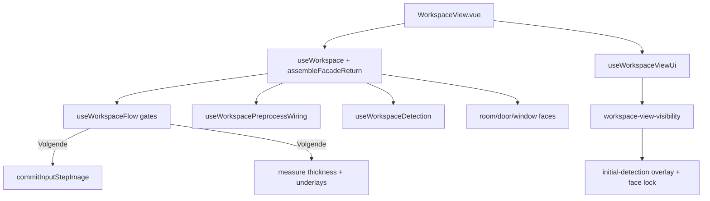

# Refactor rapport — UI / UX workspace — 2026-07-25

## Meta

| Veld | Waarde |
|------|--------|
| Module | `frontend/src/ui/composables/workspace/**` + `useWorkspace` + `WorkspaceView` + overlays/gates |
| Diepte | B (facade/view splits = mid–hoog) |
| Doel | overdracht / deprecated aliases / god-trio facade |
| Status | Batch 1–3 gedaan (2026-07-27); Batch 2 facade/view = **ronde 13** |
| Gerelateerde docs | [`../workspace-flow.md`](../workspace-flow.md), deelrapporten stap 1–4 |

## Samenvatting

- Workspace composables-map: 33+ files (helpers/bind/snap erbij).
- God-trio (≈07-27 post-ronde 8): `useWorkspace` + `assembleWorkspaceFacadeReturn` + `WorkspaceView` — face-composables dunner (Room **752** / DoorSwing **747** / Window **686** + extract modules).
- Migratieresten: OCR/gaps sticky, null `roomPreviewMaskUrl` (P0 deels gedaan).

## Architectuurkaart (huidig)

**Entry / stages / outputs**

- Facade assembleert 15+ composables → flat API naar View
- Gates: `constants` (`inputStepCanProceed`, `preprocessStepCanProceed`) + `useWorkspaceFlow`
- Visibility: `workspace-view-visibility.ts` + `useWorkspaceViewUi` (initial-detection busy/steps, face-select lock)
- Stap-3 gate: overlay tot muur+deur+raam eerste pass; settled latch
- Lifecycle: `useWorkspaceLifecycle` (reset, undo-keys, OCR warm-up)
- Detection UI: `useWorkspaceDetection` (LBE, dikte, modes)
- Dev: `useWorkspaceDevSession` (~264 + capture/restore helpers) + `buildWorkspaceDevSessionDeps`
- OCR: alleen `useWorkspaceOcr` (niet geometry-pipeline)

## Findings

### D — Dead

| Item | Evidence | Batch | Risico |
|------|----------|-------|--------|
| `playDevSessionToStep3` | `@deprecated` alias `restoreDevSession`; nog geëxporteerd | 1 | Laag |
| `roomPreviewMaskUrl` altijd `null` | `@deprecated`; nog in facade/overlays | 1 | Laag |
| `signatureForParentMap` | knip unused (door helpers) | 1 | Laag |
| `editWorkingCanvas` stub | inkEdit → image wiring | 1 | Laag |

### W — Wet / duplicaat

| Locatie A | Locatie B | Owner-voorstel | Batch | Risico |
|-----------|-----------|----------------|-------|--------|
| Facade object-spread | View kent geen package-grenzen | Return-slices per stap | 2 | Mid–hoog |
| Visibility helpers vs sidebar props | herhaalde flowStep/tab-checks | pure visibility als single source | 2 | Mid |
| Mask history vs ink history | zie stap 1/2 | gedeelde undo-helper | stap1/2 | Laag |

### H — Half-steen

| Item | Canonieke vervanger | Batch | Risico |
|------|---------------------|-------|--------|
| Gaps/OCR sticky redirects | `stickyPreprocessTab`/`stickyTemplateTab` + DevSession (safety-net F) | ~~ronde 13~~ | — |
| `gapsInkMode` localStorage | `useGapsInkModePersistence`; F behouden | ~~ronde 13~~ | — |
| `preprocessTab` init `'ocr'` | default `'walls'` | ~~ronde 3~~ | — |
| `visiblePreprocessLayerTabs(_ocrEnabled)` unused arg | drop param | 1 | Laag |

### M — Magic number

| Waarde | Bestand | Betekenis | Const-voorstel | Batch |
|--------|---------|-----------|----------------|-------|
| Initial-detection step labels NL strings | `resolveTemplatesInitialDetectionSteps` | UI copy | i18n later / const map | F |
| Overige | zie stap 1/2 | — | — | — |

### T — Test-gericht

| Item | Spec / productie | Actie | Batch |
|------|------------------|-------|-------|
| geen specifiek in facade | visibility pure functions = goed testbaar | behouden | F |

### G — God-file / structuur

| Bestand | Regels (≈07-27) | Split-voorstel | Batch | Risico |
|---------|------------------|----------------|-------|--------|
| `useWorkspaceWindowFaces.ts` | **686** (+ helpers/bind) | ~~split~~ **ronde 8** | 3 | — |
| `useWorkspaceDoorSwingFaces.ts` | **747** (+ door-faces-snap) | ~~split~~ **ronde 8** | 3 | — |
| `useWorkspaceRoomFaces.ts` | **752** (+ demote-guards) | ~~demote extract~~ **ronde 8** | 3 | — |
| `useWorkspace.ts` | leaner (+ gaps persistence extract) | ~~wiring + slices~~ **ronde 13** | 2 | — |
| `WorkspaceView.vue` | FML panel/preview hosts + floorplan shell | ~~presentational~~ **ronde 13** | 2 | — |
| `useWorkspaceDevSession.ts` | **~264** (+ capture/restore-*) | ~~capture vs restore~~ **ronde 15** | later | — |
| `useWorkspaceExports.ts` | **~70** (+ workspace-export-*) | ~~split~~ **ronde 14** | later | — |
| `assembleWorkspaceFacadeReturn.ts` | construction slices; flat keys | ~~per-stap builders~~ **ronde 13** | 2 | — |

### P — Policy / tuning ruis

| Item | Actie nu | Notitie |
|------|----------|---------|
| `GAPS_TAB_VISIBLE = false` + volledige gaps-pipeline | F | half-feature bewust |

### F — Bewust behouden

| Item | Reden |
|------|-------|
| Vier `flowStep`-waarden + gates | contract |
| `workspace-view-visibility` pure functions | testbaar |
| Initial-detection gate + settled-latch | recent besluit |
| Face bbox-index + demote live-prune (deur/raam) | perf + schone overlay/FML; memory 2026-07-25/26 |
| `tabOutputs` alleen detectie-run | contract |
| OCR alleen `useWorkspaceOcr` | contract |
| `isValidTabOutput` / layer-flow | niet breken |
| Worker `registerAllExtractors` + canvasEnv | niet breken |
| `exportExamplesReport` publieke key (layer-debug-v2) | misleidende naam; rename = breaking; ronde 14 F |

## Voorgestelde batches

1. ~~**Batch 1 — P0 deprecated aliases + default-tabs**~~ **gedaan** — `playDevSessionToStep3`, `roomPreviewMaskUrl`, `editWorkingCanvas`, `_ocrEnabled`
2. ~~**Batch 2 — P1 facade/view slice**~~ **gedaan** ronde 13 — assemble construction-slices (flat keys); sticky helpers; View → `WorkspaceFmlResultPanel` / `WorkspaceFmlPreviewHost` / `WorkspaceFloorplanCanvasHost`; gaps-ink persistence extract
3. ~~**Batch 3 — P2 face-composables**~~ **gedaan** ronde 8 — demote-guards / window helpers+L14 bind / door-faces-snap
4. ~~**Batch 4 — P2 exports split**~~ **gedaan** ronde 14 — `workspace-export-{shared,underlay,layer-debug,reference-analysis,door-swing-report,window-face-report}`; lean entry ~70; return-keys stabiel; `exportExamplesReport` naam **F**
5. ~~**Batch 5 — P2 DevSession split**~~ **gedaan** ronde 15 — `workspace-dev-session-{capture,restore-base,restore-detection,restore-flow}`; lean entry ~264; exact/replay + return-keys stabiel

## Niet doen

- OCR terug in geometry-pipeline
- Gaps-tab aanzetten zonder besluit
- Big-bang facade herschrijf + feature in één PR
- `HTMLImageElement`/`document` in worker
- Gedeelde `opening-faces-refresh-shell` (diepte C) zonder apart go
- Rename `exportExamplesReport` / live `orientedDoors` i.p.v. pipeline re-run (stap4-conversie Batch 3)
- DevSession restore-semantiek / platform schema herschrijven

## Verificatie

- [x] `npx vitest run tests/ui/use-workspace-fml.spec.ts tests/ui/window-stage-cache-prune.spec.ts tests/ui/useWorkspaceRoomFaces-door-demote.spec.ts` — 12/12
- [x] `npx vite build` OK (volledige `vue-tsc -b` heeft pre-existing errors buiten facade-scope)
- [ ] UI-smoke Project4: 4 stappen + sticky restore ocr/gaps → walls; FML panel+preview
- [x] ronde 14: `npx vitest run tests/platform/export/layer-debug-v2.spec.ts tests/platform/export/door-swing-report.spec.ts` — 6/6; `npx vite build` OK
- [ ] UI-smoke Project4: stap1/2 downloads + debug-panel exports
- [x] ronde 15: `npx vitest run tests/dev-workspace` — 16/16; `npx vite build` OK
- [ ] UI-smoke Project4: DevSession opnemen/herstellen (exact review + sticky + replay)

## Log

- **2026-07-28 — ronde 15:** DevSession split capture/restore-*; `wallBwPreviewUrl` + unused `resetWallBwCompose` weg; return-keys stabiel.
- **2026-07-28 — ronde 14:** dead deps weg; DRY door-helpers/imageUtils; split underlay/layer-debug/ref/deur/raam; lean `useWorkspaceExports` ~70.
- **2026-07-27 — ronde 13:** sticky `stickyPreprocessTab`/`stickyTemplateTab`; assemble slices; View presentational hosts; `useGapsInkModePersistence`; flat facade API behouden.
| Datum | Batch | Resultaat |
|-------|-------|-----------|
| 2026-07-25 | — | inventaris alleen |
| 2026-07-27 | — | docs-sync: god-file counts, demote/bbox F |
| 2026-07-27 | 1 (P0) | `playDevSessionToStep3` / `roomPreviewMaskUrl` / `editWorkingCanvas` / `_ocrEnabled` weg |
| 2026-07-27 | 3 (ronde 8) | `room-face-demote-guards`; `window-faces-helpers`+`bind`; `door-faces-snap`; faces ~752/747/686; UI specs 10/10; Project4 smoke functioneel OK |
| 2026-07-28 | 4 (ronde 14) | exports split; return-keys stabiel; vite + platform export specs OK |
| 2026-07-28 | 5 (ronde 15) | DevSession split; 16/16 dev-workspace; vite OK |
